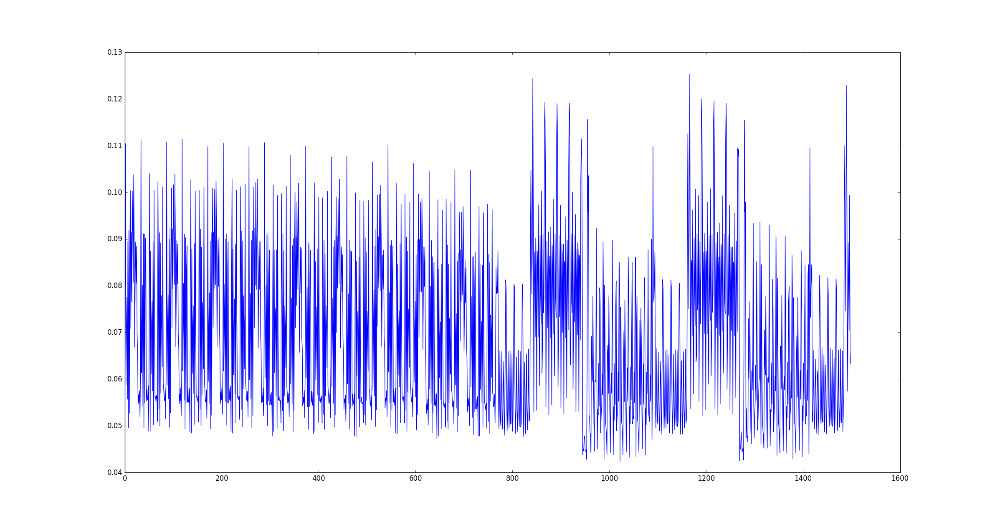
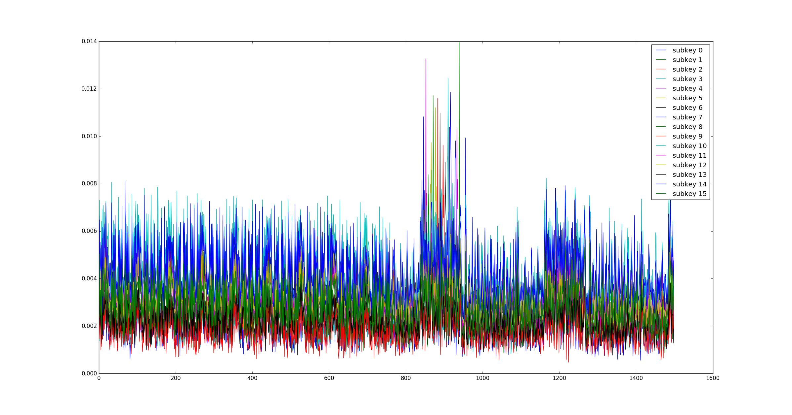

# Screaming Channels

Welcome to the Screaming Channels project!

This repository contains all what you need to reproduce our findings about radio side channels in mixed-signal chips.
For more information you can also have a look at:

* [Paper to appear at CCS 2018](http://s3.eurecom.fr/docs/ccs18_camurati_preprint.pdf)
* [Talk at Black Hat USA 2018](https://www.blackhat.com/us-18/briefings.html#screaming-channels-when-electromagnetic-side-channels-meet-radio-transceivers)
* [Webpage](http://s3.eurecom.fr/tools/screaming_channels/)

Please feel free to contact us ([Giovanni Camurati](mailto://camurati@eurecom.fr)) for any comment, issue, or question.

If you wish to contribute, please follow this [Contribution
Guideline](Contribution Guideline)

# Warning

This repository contains a large number of traces, and may take a while to
download.

# Index

* [License](#License)
* [Files](#Files)
* [Long story short](#Story)
* [Using the code](#code)
    * [Overview](#Overview)
    * [Experimental setup](#setup)
    * [Firmware](#Firmware)
    * [Trace collection](#Collection)
    * [Attacks](#Attacks)
    * [Using our traces with other tools](#Others)
* [Known issues](#Issues)
* [FAQ](#FAQ)
* [Contribution Guideline](#Guideline)

## <a name="License"></a>License

Copyright (C) EURECOM
Copyright (C) Giovanni Camurati, Sebastian Poeplau, Marius Muench, Tom Hayes, Aurélien Francillon

This screaming_channels repository contains what is necessary
to reproduce the results of the Screaming Channels project.

Certain files in this project may have specific licenses or copyright
restrictions, as this project uses multiple open-source projects.
Files in this project without any specific license can be assumed
to follow the following general clause:

screaming_channels is free software: you can redistribute it and/or modify
it under the terms of the GNU General Public License as published by
the Free Software Foundation, either version 3 of the License, or
(at your option) any later version.

screaming_channels is distributed in the hope that it will be useful,
but WITHOUT ANY WARRANTY; without even the implied warranty of
MERCHANTABILITY or FITNESS FOR A PARTICULAR PURPOSE.  See the
GNU General Public License for more details.

You should have received a copy of the GNU General Public License
along with screaming_channels.  If not, see <http://www.gnu.org/licenses/>.

## <a name="Files"></a>Files

    .
    ├── firmware                                Firmware on the device
    │   ├── blenano2                            Folder for the BLE Nano v2 example example
    │   ├── main.c                              The main application (radio settings, crypto)
    │   ├── boards.h                            Definition of different boards
    │   ├── rblnano2.h                          Board configuration file for the BLE Navo v2
    │   ├── Makefile.posix                      Makefile to define the compilation toolchain
    │   └── README                              Compilation instructions
    ├── experiments                             Scripts and configs for experiments, trace collection, and attacks
    │   ├── config                              Sample configuration files for collection
    │   ├── templates                           Sample trace template files for collection
    │   ├── tra_templates                       Sample templates for the attacks
    │   ├── setup.py                            Setup file to install our tools
    │   └── src                                 Source code of the our tools
    │       └── screamingchannels
    │           ├── reproduce.py                Script for experiments, including trace collection
    │           ├── attack.py                   Script for attacks
    │           ├── analyze.py                  Module for processing traces
    │           ├── load.py                     Module for loading traces
    │           └── sc2daredevil.py             Script to convert traces to Daredevil format
    ├── images                                  Images for this file
    ├── traces                                  Sample traces that we have collected
    ├── COPYRIGHT                               The copyright 
    ├── LICENCE                                 A copy of the GNU GPL v3.0 license
    └── README.md                               This file
 
## <a name="Story"></a>Long story short

1. Mixed-signal circuits are popular (cheap integrated solution for
   radio communication)
2. The digital part (noisy) is close to the analog/RF part (noise sensitive)
3. Propagation (e.g., substrate / power supply coupling to the Frequency Synthesizer / Power Amplifier)
4. Sensitive information regarding the digital activity flows to the radio where
   it is picked and transmitted
5. Side-channel attacks possible at a considerable distance

## <a name="code"></a>Using the code

### <a name="Overview"></a>Overview

The general idea is that a control laptop drives both the chip under attack and
a software defined radio tuned into the leak. The laptop also performs the
required signal processing and stores the traces.

### <a name="setup"></a>Experimental setup

To use this repository you will need:

1. A [BLE Nano v2](https://redbear.cc/product/ble-nano-kit-2.html), on which you
   will flash the custom firmware. The firmware can control the radio, run
   simple loops, or call software or hardware AES encryptions. With simple
   changes to the header files, you can also run it on other nRF52832 based
   devices. You can also write your own firmware, keeping the same API, to
   experiment with other chips.

2. A Software Defined Radio. Any radio which can listen at 2.4GHz and sample at
   5MHz should be enough. We have conducted our experiments with a [HackRF](https://greatscottgadgets.com/hackrf/) and,
   especially for the long range attacks, a [USRP N210](https://www.ettus.com/product/details/UN210-KIT) populated with a
   [SBX](https://www.ettus.com/product/details/SBX) daughter board. Our code
   also supports the [USRP B200 mini](https://kb.ettus.com/B200/B210/B200mini/B205mini) and the [BladeRF](https://nuand.com/) (complete attack not tested yet with B200 mini or BladeRF).
   In general, it is very easy to add support for any radio which is supported
   in GNU Radio.

3. Short range attacks may succeed with a simple off-the-shelf WIFI or BT
   antenna. For the long range attacks, a directive high-gain antenna is
   important. We use a [TP-Link TL-ANT2424B](https://www.tp-link.com/us/products/details/cat-5067_TL-ANT2424B.html).

4. You may want to add one or more low-noise amplifiers (we often use two 
   [Minicircuits ZEL 1724 LNA](https://www.minicircuits.com/WebStore/dashboard.html?model=ZEL-1724LN%2B)), and a DC
   block.

5. It is very convenient to add a USB switch to turn on and off the device, we
   use the [YKUSH](https://www.yepkit.com/products/ykush).

6. A laptop which controls the chip and the radio, and which runs all the
   required signal processing. A reasonably powerful laptop is necessary to make
   the collection fast. For example, we have reasonable performance with the following:
   Intel Core i7-4700MQ 2.4GHz, 12GB RAM, Ubuntu16.04 LTS, USB3.0 external SSD
   Drive.

7. Refer to the single sections for a description of the required software
   dependencies.

### <a name="Firmware"></a>Firmware

For this part you need:

1. A toolchain for Arm, we use [gcc-arm-none-eabi-7-2017-q4-major](https://developer.arm.com/open-source/gnu-toolchain/gnu-rm/downloads).
1. A tool to communicate with the device, e.g. ```minicom```.

Let's first get the SDK and copy our files to the right folders. We also need to
export an environment variable with the path to the SDK.

```
cd $SCREAMING_CHANNELS_PATH/screaming_channels/firmware
wget
https://www.nordicsemi.com/eng/nordic/download_resource/59011/68/92912988/116085
unzip 116085
rm 116085
cp boards.h nRF5_SDK_14.2.0_17b948a/components/boards/
cp Makefile.posix nRF5_SDK_14.2.0_17b948a/components/toolchain/gcc
cp rblnano2.h  nRF5_SDK_14.2.0_17b948a/components/boards/
```

Now we can compile any application, including our custom firmware. Note that we
have to pass the path the toolchain with the ```GNU_INSTALL_ROOT``` option.

```
make GNU_INSTALL_ROOT= $GCC_PATH/gcc-arm-none-eabi-7-2017-q4-major/bin/ -C blenano2/blank/armgcc
```

To program the device, we can simply copy the binary there.

```
cp blenano2/blank/armgcc/_build/nrf52832_xxaa.hex /media/$USER/DAPLINK/
```

Finally, we can connect to the device (you may want to add a USB rule for it).

```
minicom -D /dev/ttyACM0
```

If you enter ```h``` A self-explanatory menu should appear as follows.
You will find the commands to control the radio as well as those to run
different types of software or hardware encryption. Another important option is
the one that controls the output power. Usually, for better results, we set it
to the maximum power (```p0``` which corresponds to +4dBm). However, be careful
and make sure your radio setup can handle the power, especially if you decide to
replace the antennas with a direct cable connection.

```
Usage:
a: Enter start channel for sweep/channel for constant carrier
b: Enter end channel for sweep
c: Start TX carrier
d: Enter time on each channel (1ms-99ms)
e: Cancel sweep/carrier
f: Toggle CCM power
g: Change CCM counter
i: Start (unmodulated) TX carrier with active CCM
j: Start (unmodulated) TX carrier with active CCM and delays
l: Test the crypto hardware
m: Enter data rate
o: Start modulated TX carrier
p: Enter output power
q: Start modulated TX carrier with encryption
s: Print current delay, channels and so on
r: Start RX sweep
t: Start TX sweep
x: Start RX carrier
y: Start noisy operation
z: End noisy operation
n: Enter tiny_aes_128 mode
   p: Enter plaintext
   k: Enter key
   e: Encrypt
   n: Set number of repetitions
   r: Run repeated encryption
   q: Quit tiny_aes_1v: Enter simplified power analysis mode
   m: Enter switching mask
   s: Switch
   q: Quit power analysis mode
u: Enter hwcrypto mode
   p: Enter plaintext
   k: Enter key
   e: Encrypt
   o: Print encrypted ciphertext
   q: Quit hwcrypto mode
w: Enter aes_masked mode
   0: Set mask mode to UNMASKED
   1: Set mask mode to RIVAIN-PROUFF
   2: Set mask mode to RIVAIN-PROUFF-SHARED
   3: Set mask    4: Set mask mode to RAND-TABLE-INC
   5: Set mask mode to RAND-TABLE-WORD
   6: Set mask mode to RAND-TABLE-WORD-INC
   7: Set mask mode to RAND-TABLE-SHARED
   8: Set mask mode to RAND-TABLE-SHARED-WORD
   9: Set mask mode to RAND-TABLE-SHARED-WORD-INC
   p: Enter plaintext
   k: Enter key
   e: Encrypt
   o: Print encrypted ciphertext
   n: Set number of repetitions
   r: Run repeated encryption
   q: Quit aes_masked mode
```

To exit from ```minicom``` simply press ```CTRL-a x```.

We suggest you to play around with this menu and a spectrum analyzer (or simply
your SDR) and to observe what we describe in our paper.
For example, you can tune to 2.464GHz (carrier frequency of channel 0 + clock
frequency) and press ```h```, you will not see
anything. But if you turn on a continuous TX wave by pressing ```c``` and then
press ```h```, you will see the corresponding noise.
You can also write your own functions and experiment.

### <a name="Collection"></a>Trace collection

To start, you first have to install the "Screaming Channels tools".
You can use the

```
cd experiments/src/
python2 setup.py develop --user
```
or
```
cd experiments/src/
python2 setup.py install [--user]
```

Now you should be able to run ```sc-experiment``` and ```sc-attack```.
The first one is for trace collection and other experiments, whereas the second
one is for running the attacks.

In this part we focus on ```sc-experiment```, for trace collection. Let's
analyze an example.

First, we want to collect a single ecryption, to plot the data and tune the
parameters. Adapt the options in the following command for your radio and
device. Try the command at a distance of some centimeters, say 10
cm, and you should be able to observe a clean AES trace. (The same command
should
work also at several meters, but in this case you may need a better antenna,
amplifiers, some more careful tuning of the configuration, etc. So we suggest
you to start with something simple and well under control, without other devices
on the same channel, etc.)

```
mkdir traces/example_collection_data
cd experiments
sc-experiment --radio=HackRF --device=/dev/ttyACM0 collect config/example_collection_plot.json ../traces/example_collection_data --plot
```

Note that before running the previous command, you may want to set the output
power to the maximum (always be careful about the
maximum ratings of your setup): connect ```minicom -D /dev/ttyACM0``` and send
```p0```. You can automate this by adding it to the ```reproduce.py``` script. 

Here is what the output should look like. The first subplot is the time-domain
trace, the second one is a spectrogram, the third one is the power spectrum,
the fourth one shows all the extracted
traces after alignement, the last one is the average.
A detailed explanation of the
configuration file and an image that explains the parameters on the plot will
follow. 


The most important part of the command is the configuration file. The
config/example_collection_plot.json was derived from our attack at 5 m in an
anechoic room. In the following, we will explain the main parameters and how to
find them in case none of the provided configuration files is suitable for your
case, e.g., because you attack other AES implementations.

Here is a copy of the configuration file.

```
{
    "firmware": {
        "mode": "tinyaes",
        "fixed_key": true,
        "modulate": true
    },
    "collection": {
        "target_freq": 2.528e9,
        "sampling_rate": 5e6,
        "num_points": 1,
        "num_traces_per_point": 100,
        "bandpass_lower": 1.85e6,
        "bandpass_upper": 1.95e6,
        "lowpass_freq": 5e3,
        "drop_start": 50e-3,
        "trigger_rising": true,
        "trigger_offset": 100e-6,
        "signal_length": 300e-6,
        "template_name": "templates/tiny_anechoic_5m.npy",
        "min_correlation": 0.00
    }
}
```

The first part, ```firmware```, configures the firmware on the device.
The ```mode``` selects the software or hardware AES implementation to use,
the ```fixed_key``` option decides whether to keep the same key at each
encryption or not, and ```modulate``` choses between modulated radio
transmission of packets or transmission of a continuous wave.

The second part, ```collection```, lets you tune the parameters for trace
extraction.

Here is a visual explanation of the parameters on a zoom of the plot that we saw
before. The main point is setting the parameters to use a frequency component as
trigger for extraction. This was inspired by [RSA-SDR](https://github.com/bolek42/rsa-sdr).
The ```template_name``` refers to a reference trace used for
fine grained alignment.


Here follows a brief explanation of the procedure to set all the collection
parameters. This is useful if you cannot use the configuration files we provide,
e.g., because your setup is different.

1. Use the ```--plot``` parameter to plot 4 subplots

2. Use the ```--average-out=/tmp/template.npy``` option, its use will be clearer
   later.

3. Setting ```modulate``` to false (continuous wave instead of packets) may
   simplify the procedure in some cases.

4. Set ```num_points``` to 1 and number of traces per point to a little number,
   usually 100 to 200. We put a limit at 300 in case the ```--plot``` option is on,
   because the plot is resource consuming and may be too much for your machine.
   However, in some cases it may be necessary/useful/possible to plot with more
   than 300 points. In this case, just disable the assertion that will
   fail in ```reproduce.py```.

5. Set the ```template``` parameter to "". We will generate this file later.
   Alternatively, use one of the provided templates in the ```templates```
   folder.

6. You can see a ```drop_start``` parameter in config.json to drop the transient at
   the beginning of the trace. You can start by 0 (no cut) and then cut it to the
   desired amount after visual inspection (you should be able to easily spot where
   the regular encryptions start after  an initial transient)

7. Run the collection. At this point in time, you need to care only about the two first subplots,
   if the next ones give errors, at worst comment the corresponding
   code in ```analyze.py```.

8. Now, by looking at spectrogram, you should be able to distinguish some frequency component that appears 
   regularly during (or between) encryptions. Use the two filter frequency in the 
   .json (```bandpass_lower``` and ```bandpass_upper```) to isolate such component
   (bandpass around it) and low pass filter it (```lowpass_freq```). The low-pass 
   frequency is much lower than the lower band-pass, but higher than the frequency 
   at which the encryptions repeat. The result will be a ‘square’ signal roughly 
   indicating the encryptions. It is plotted in greenish in the first subplot. 
   The brownish signal is the average of this square wave. The code finds the 
   (rising/falling) intersections and consider them as starts of the encryption, 
   marked with a vertical red line. You have a parameter (```trigger_rising```) to chose rising/falling, 
   and a parameter to set an offset from the intersection point (```trigger_offset```). Use them to move 
   the red line to a convenient point before the first round, I suggest a point in 
   the first part of the key schedule ( identifying key schedule and rounds should 
   be easy if the signal is good). Then, there is a length parameter (```signal_length```) to tune to move 
   the end of the extraction window, that you can see as a green vertical line in 
   the first subplot. Set it after the first round, I suggest after the second. 
   The final result in the first subplot should be ‘num traces per point’ windows 
   (each marked by red and green vertical lines), each roughly enclosing the 
   first round of an encryption.

9. If everything went well, the third subplot plots the traces extracted with the 
   windows and further finely aligned with cross correlation. The first time set 
   the template to null and this step will use the first window as template. If 
   the result is good (aligned traces, clear average in the fourth subplot), 
   you can take the file saved with ```—average-out```, and use it as template for 
   the next times.

10.  Once you have a good template, try increasing the number of traces per point, 
    and if the result is better you can use it as new template, iteratively. After 
    300 traces per point it’s better to disable the plot, as it is very big and heavy. 
    In general, it’s better to set ulimit. 

Though initially painful, the settings are relatively stable for a given configuration and small variations. 
Once you are ready with the configuration, disable the ```--plot``` option, and
increase the ```num_points``` to a large number. Beware that the collection
generates random plaintexts and key and cannot be restarted, and the number of
traces cannot be increased later. So, for the first time in a given
configuration, it is better to set a large number, and kill the collection as
soon as an attack successfuly recovers the key (collection and attack can be run
in parallel).

Do not forget to set the power to 4dBm if your setup allows it. The collection
may take a while, the script will tell you the expected duration.

### <a name="Attacks"></a>Attacks

To start, you first have to install the "Screaming Channels tools".
You can use the

```
cd experiments/src/
python2 setup.py develop --user
```
or
```
cd experiments/src/
python2 setup.py install [--user]
```

Now you should be able to run ```sc-experiment``` and ```sc-attack```.
The first one is for trace collection and other experiments, whereas the second
one is for running the attacks.

There are two attacks available (code based on the [ChipWhisperer](https://newae.com/tools/chipwhisperer/)):

1. Correlation Radio Attack (CRA), equivalent to a Correlation Power Attack.
2. Template Radio Attack (TRA), equivalent to a Template Radio Attack

Let's first play with the CRA. You can either use your own traces or use the
prerecorded ones as we do here. The main parameters for the attack are the number of traces
```--num-traces``` (the maximum available if you put 0), and the attack window
defined by ```--start-point``` and ```--end-point``` (The entire trace if you do
not specify them). To chose the window, you can first plot (```--plot```) the
traces. The tool will first show you all the traces aligned on the same plot
(careful if they are many) and then the Sum of Absolute Differences (which
should be higher where the traces differ e.g. because of the key). Use the two
plots to manually identify the first round of AES, at the output of the SBox.
The attack works better if you do it, because we eliminate a lot of points which
slow down the processing and add noise.

Follows an example. In this case we do not really need to tune the window to
make it work, but you can play with it. Moreover, we use a ```name``` parameter.
This is necessary only if the name parameter was used also during collection.
We keep it for retrocompatibility, but we think that it is not very useful and
you can just don't use it for your collections. You may want to use the --plot
paramenter only with a few traces, and then run the attack with the big number
of traces without plotting. The shape is slightly different here, because
mbedtls AES is different that TinyAES, and because we add a preamble before
encrypting to make alignment easier.

```
cd experiments
sc-attack --plot --data-path=../traces/mbedtls_1m_home --name=mbed_villa_500 --start-point=0 --end-point=0 --num-traces=1000 cra
sc-attack --data-path=../traces/mbedtls_1m_home --name=mbed_villa_500 --start-point=0 --end-point=0 --num-traces=38645 cra
```

While running, the attack will show the correlation coefficient for each byte
for each guess.

```
...
Subkey  0, hyp = 6a:  0.0120951037728
Subkey  0, hyp = 6b:  0.016355825379
Subkey  0, hyp = 6c:  0.0176816695528
Subkey  0, hyp = 6d:  0.0147174374587
Subkey  0, hyp = 6e:  0.0212532863606
Subkey  0, hyp = 6f:  0.0156095992469
...
```

The final result will be this one (or similar if you use your own traces). The
first two lines show the bytes of the best guess and of the known key,
respectively. The PGE is the Partial Guessing Entropy, which is the "distance"
of our best guess from the known byte, and therefore it is 0 when the guess is
correct. Our tool ranks the guesses, with the most likely at 0 and the least
likely at 255, and the PGE is the rank of the known key.

```
Best Key Guess:   56   89   ed   be   4c   65   db   f2   aa   2c   bd   c9   26   42   e6   e1  
Known Key:        56   89   ed   be   4c   65   db   f2   aa   2c   bd   c9   26   42   e6   e1  
PGE:             000  000  000  000  000  000  000  000  000  000  000  000  000  000  000  000  
SUCCESS:           1    1    1    1    1    1    1    1    1    1    1    1    1    1    1    1  
NUMBER OF CORRECT BYTES: 16
```

Let's now try a template attack. If you want to try it with your traces, you
need to collect two sets: a template set with a very large number of traces, and
an attack set with a smaller number. In this example we will use the traces we
have collected in the anechoic room at 10 meters, with the ```config/tiny_aes_anechoic_10m_080618.json```
file that you can find in this repo. The code under attack is TinyAES.

First, we use the template set to create a template. We first create a folder
where we can store the template. Again we could set the window, but we don't
need it. The template attack first uses the Sum of Absolute Differences SOAD to
detect the points of interest, that is the point of the trace that "leak". They
are simply the peaks of the SOAD. You can configure how many peaks you want with
```--num-pois``` and the minimum distance between adjacent peaks with
```--poi-spacing```. Note that the number of traces is very large, so it is
better to use the plot option on a smaller subset. Besides plotting the average
trace, the script will also plot the SOAD, where you will clearly see a peak for
each byte of the key.

```
cd experiments
mkdir tra_templates/my_template
sc-attack --plot --data-path=../traces/tinyaes_anechoic_10m_080618_template --start-point=0 --end-point=0 --num-traces=50000 tra_create tra_templates/my_template --num-pois=10 --poi-spacing=1
```

You should see the following average and SOAD.




Now run without plotting with more traces.

```
sc-attack --data-path=../traces/tinyaes_anechoic_10m_080618_template --start-point=0 --end-point=0 --num-traces=129661 tra_create tra_templates/my_template --num-pois=10 --poi-spacing=1
```

Once the template is ready, we can run the actual attack. If you want, you can
skip the previous step and directly use the template provided
in ```tra_templates/template_anechoic_10m_080618```. Note 
that ```--num-traces=0``` will simply take all the traces.

```
sc-attack --data-path=../traces/tinyaes_anechoic_10m_080618_attack --start-point=0 --end-point=0 --num-traces=0 tra_attack tra_templates/my_template
```

The output should look like this.

```
subkey 0 found with 47 traces
subkey 1 found with 36 traces
subkey 2 found with 238 traces
subkey 3 found with 259 traces
subkey 4 found with 124 traces
subkey 5 found with 304 traces
subkey 6 found with 177 traces
subkey 7 found with 1656 traces
subkey 8 found with 53 traces
subkey 9 found with 549 traces
subkey 10 found with 106 traces
subkey 11 found with 708 traces
subkey 12 found with 285 traces
subkey 13 found with 300 traces
subkey 14 found with 556 traces
subkey 15 found with 681 traces
Best Key Guess:   66   ff   31   bb   3f   db   5f   6d   19   06   b7   e4   03   96   38   54  
Known Key:        66   ff   31   bb   3f   db   5f   6d   19   06   b7   e4   03   96   38   54  
PGE:             000  000  000  000  000  000  000  000  000  000  000  000  000  000  000  000  
SUCCESS:           1    1    1    1    1    1    1    1    1    1    1    1    1    1    1    1  
NUMBER OF CORRECT BYTES: 16
```

### <a name="Others"></a>Using our traces with other tools

You can use ```sc2daredevil.py``` to convert the traces to the
[Daredevil](https://github.com/SideChannelMarvels/Daredevil) format.

From the Daredevil format, 
you can further convert to .trs to use them with [Jlsca](https://github.com/Riscure/Jlsca)
(use the splitbin2trs script provided there).

### <a name="Jlsca"></a>Example: Attacking from 10 m with a LRA from Jlsca

First, we need to apply a few changes to ```load.py``` and
to ```sc2daredevil.py```:

1. Following the instructions in [Missing normalization of the traces](#Missing normalization of the traces), add the
   normalization of traces to ```load.py``` (i.e., divide each trace by its
   average)

2. In the ```sc2daredevil.py``` script, reprace the call to ```traces = load_traces('%s/avg_%s' % (trace_directory, trace_name), number)```
   with ```traces = load_traces('%s/avg_%s' % (trace_directory, trace_name), number, 849, 950)```. This is simply to focus the attack exactly on the first round.

We can now convert 5000 (each obtained by averaging 500 encryptions) traces to Daredevil with the following command:

```
python2.7 src/screamingchannels/sc2daredevil.py /traces/tinyaes_anechoic_10m_080618_template "" 5000 
```


After installing julia and importing all the required modules, we can now call
the splitbin2trs function provided by Jlsca in the trs-convert.jl script
(plaintext and tracefile are generated by the sc2daredevil.py script in the
current folder):

```
julia> splitbin2trs("plaintext", 16, "tracefile", 101, UInt32, 5000, false)
Creating Inspector trs file output_UInt32_5000t_bitsasbytes.trs
#samples: 101
#data:    16
type:     UInt32
Wrote 5000 traces in output_UInt32_5000t_bitsasbytes.trs
```

We can now convert the file name to include meaningful information, e.g., the
name of the crypto algorithm and the known key:

```
mv output_UInt32_5000t_bitsasbytes.trs aes128_sb_ciph_d5c5cdfee0f187621f59e7509c0145c7.trs
```

Finally, we can run one of Jlsca attacks, for example, the liner
regression attack:

```
julia examples/main-condavg-lra.jl aes128_sb_ciph_d5c5cdfee0f187621f59e7509c0145c7.trs
```

If nothing went wrong, we should see that the key was properly recovered.
```
recovered key: d5c5cdfee0f187621f59e7509c0145c7
knownkey match: true
```

## <a name="FAQ"></a>FAQ

## <a name="Issues"></a>Known Issues

### <a name="Normalization"></a>Missing normalization of the traces

For now we do not normalize the traces in anyway during collection. This is one
of the reasons why templates created in one setup cannot be easily reused in
different setups.

You may want to add a transparent normalization step in the ```load.py```
script, as follows:

```
def load_traces(filename,number,wstart=0,wend=0):
    # load raw
    traces = []
    for i in range(number):
        # open file
        trace = np.load("%s_%d.npy"%(filename,i))
        if trace is None:
            print("ERROR null trace")
            sys.exit()
        traces.append(np.absolute(trace))

    # align
    aligned = []
    target = None
    for trace in traces:
        if target is None:
            target = trace
        else:
            shift = (np.argmax(signal.correlate(trace,
                    target)) - (len(target)-1))
            if(shift >= 0):
                trace[0:len(trace)-shift-1] = trace[shift:len(trace)-1]
                trace[len(trace)-shift+1:len(trace)-1] = 0
            else:
                trace[0:len(trace)-1+shift] = trace[0:len(trace)-1+shift]
                trace[len(trace)+shift+1:len(trace)-1] = 0

        if(wstart!=wend):
            trace = trace[wstart:wend]

        # add your normalization code here
        # for example:
        # norm = np.average(trace)
        # if norm != 0:
        #     trace = trace / norm

        aligned.append(trace)

    return np.asarray(aligned)
```

### Trace format

The trace format is not very convenient as it generates a large number of files (one per trace). 

However, you could easily modify the ```reproduce.py``` and ```load.py```
scripts to save all the traces in a single .npy file.

Moreover, you can easily convert our format to use our traces with other tools,
as explained in  [Using our traces with other tools](#Using our traces with other tools).

## <a name="Guideline"></a>Contribution Guideline

If you think somethins is wrong or missing, or if you have ideas and questions, don't hesitate
to open issues on this repository.

If you wrote a fix or improvement and would like to incorporate it, just fill a
merge request. We simply ask you to write a explanation of the problem and of
your solution, as well as to test your code so that it does not break the other
attacks. Consider adding switches if your change is very specific to a certain
case.

If you try other chips, antennas, SDRs, environments, etc., we will be very
happy if you share your setup and results, to construct a larger base of data.


