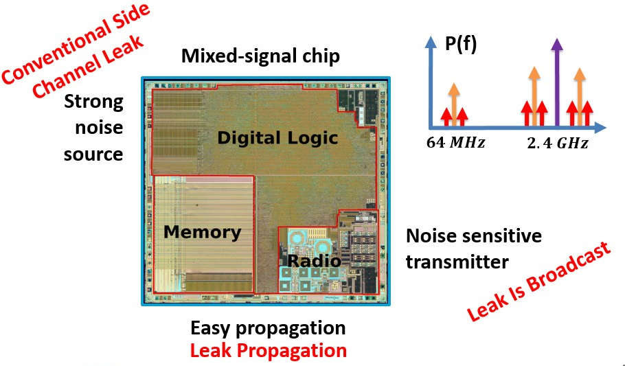
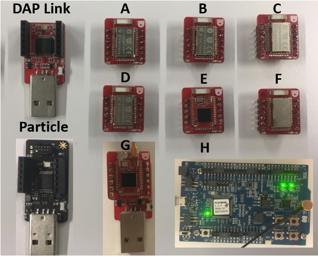
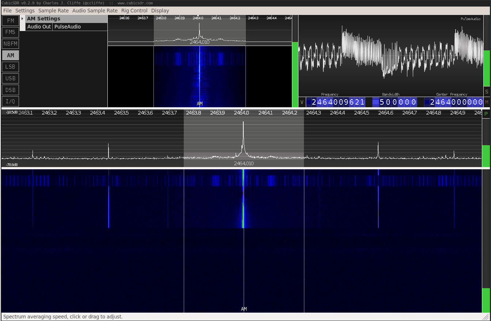
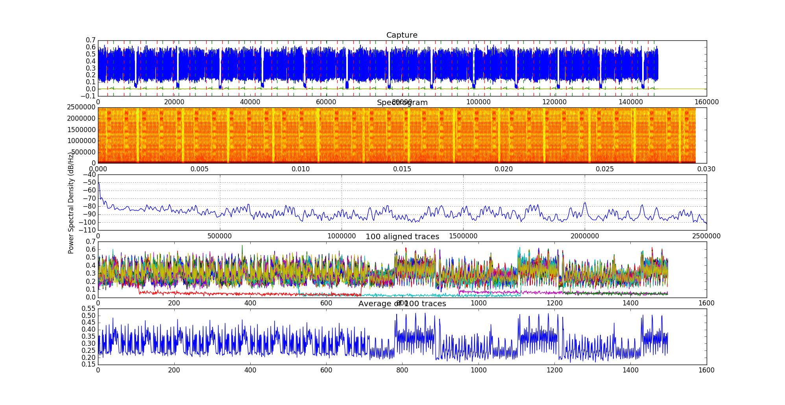
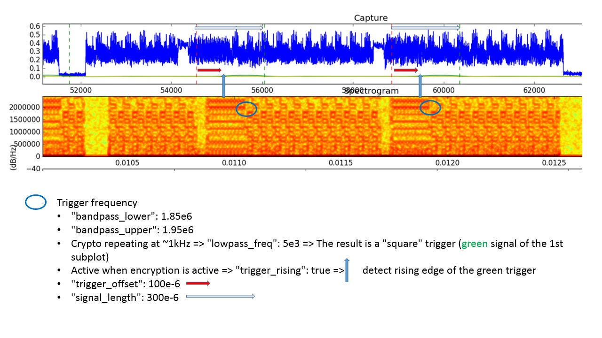
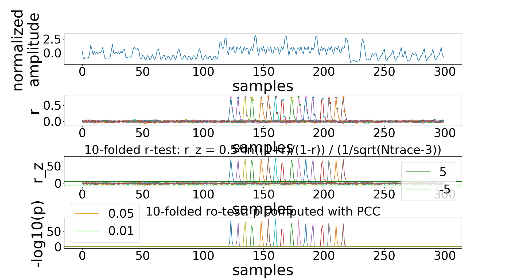
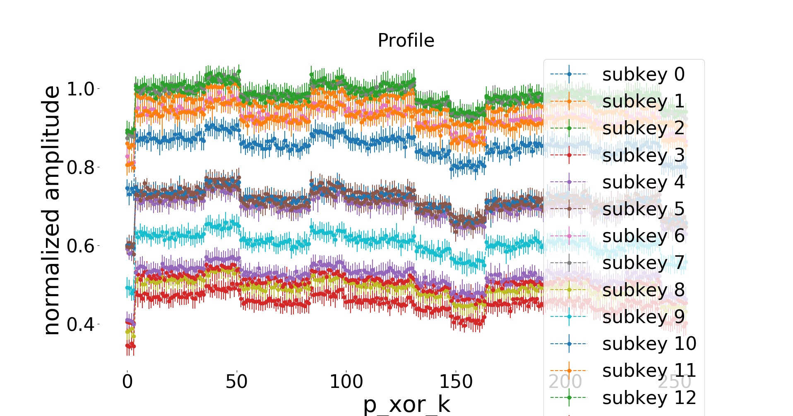

# <a name="Intro"></a>Intro

Welcome to the **Screaming Channels** project!

<!--This repository contains all that is needed to reproduce our findings on *radio-->
<!--side channels at large distance against mixed-signal chips*:-->
> Screaming Channels are a novel type of (radio) side channel attacks at large
> distance against mixed-signal chips used in modern connected devices.
> [<em><small>More details.</small></em>](#Summary)
<details>
    <summary>Expand</summary>
<blockquote>
Modern connected devices require both computing and wireless communication
capabilities. The mixed-signal architecture, which combines digital and
analog/RF logic on the same silicon die, offers many advantages and is a
popular choice. Unfortunately, the noisy digital activity can easily propagate
to the noise-sensitive radio components (e.g., substrate coupling, power
supply). As a consequence, the radio might pick-up, up-convert, amplify, and
broadcast some sensitive information about the digital activity on the chip,
making electromagnetic side-channel attacks possible at a potentially very
large distance. We call this novel side-channel vector "screaming channels", in
contrast to the low-power "whisper" of conventional electromagnetic side
channels.
</blockquote>
</details>
<br>

<p align="center">
  
</p>

<!---->

<small>
"nRF51822 - Bluetooth LE SoC : weekend die-shot" - CC-BY - 
Modified with annotations.
Original by [zeptobars][zeptobars].
</small>

## <a name="Publications"></a>Publications

* ***<mark>New!</mark>*** **CHES 2020** [Paper][ches20_paper]
  [Bibtex][ches20_bibtex]
     * ***<span style="color:#859900">Google Bughunter Program, Honorable Mention</span>***
     * Proof-of-concept attack against a real device:
         * <mark>Attack against the authentication method of Google Eddystone
           beacons.</mark>
         * The problem of <mark>Frequency Hopping can be overcome</mark> using the channel map.
     * Long-distance attacks in a real environment:
         * <mark>Key-recovery up to 15m in an office, reusing a profile</mark>
           built on a different instance, much before, in more convenient
           conditions (connection via cable).
         * Key-recovery in home environment with obstacles, leveraging
           <mark>spatial diversity</mark>
     * Attempt to attack the hardware AES block.
     * Detailed analysis of the peculiar leak vector:
         * <mark>Coexistence</mark> of (intended) radio signals and (unintended leakages).
         * <mark>Distortion of the leak model, effects of distance and channel frequency</mark>.
         * Attack techniques adapted to the channel: normalization (channel estimation), spatial diversity, profiled
           correlation attacks, multivariate template attacks, key ranking.
         * <mark>Profile reuse</mark>: profile in good conditions, reuse against a
           different device instance, at larger distance, at a different
           time.

* **CCS 2018** [Paper][ccs18_paper] [Bibtex][ccs18_bibtex]
  [Slides][ccs18_slides] [Video][ccs18_video]
    * ***<span style="color:#859900">3rd place at the CSAW Europe 2018 applied research competition</span>***
    * The idea: the coupling between digital and analog components in mixed-signal
      chips can have some security implications.
    * Correlation and Template Attacks:
        * Key-recovery at 10m in an anechoic chamber against tinyAES.
        * Key-recovery 1m in an office environment against tinyAES and mbedTLS.

* **Black Hat USA 2018** [Slides][bhusa18_slides] [Video][bhusa18_video]

<!--Currently two of the most interesting attacks are:-->
<!--* **Attack from 15m in an office environment** (Against TinyAES-128, reusing a profile built-->
  <!--much before on a different instance)-->
<!--* **Proof-of-concept attack against Google Eddystone beacons** (Against the-->
  <!--authentication protocol, unmodified demo, optimized code, frequency hopping enabled-->
  <!--but defeated with a trick, connection via cable)-->

<!--For more information you can also have a look at:-->

<!--* **CHES 2020** [Paper][ches20_paper]-->
<!--* **ACM CCS 2018** [Paper][ccs18_paper] [Bibtex][ccs18_bibtex]-->
  <!--[Slides][ccs18_slides] [Video][ccs18_video]-->
<!--* **Black Hat USA 2018**-->
  <!--[Slides][bhusa18_slides] [Video][bhusa18_video]-->
<!--* **Webpage** [News, coverage, prize, invited talks][webpage] -->

## <a name="Coverage"></a>Coverage

[Le Monde][3], [The Register][4], [Hackaday][5],
[Hackaday][6], [Security Info][7], [Tom's Hardware][8], [threatpost][9].

## <a name="Talks"></a>Talks and Presentations

* ***Black Hat USA 2018*** ([Giovanni Camurati][gc] and [Marius Muench][mm]) [Slides][bhusa18_slides] [Video][bhusa18_video]
* ***ACM CCS 2018*** ([Giovanni Camurati][gc])
* ***CSAW Europe 2018*** ([Sebastian Poeplau][sp]) <mark>3rd place at the Applied Research
  Competition</mark>
* ***GreHack 2018*** ([Marius Muench][mm]) [Video][grehack18_video]
* ***Cryptacus 2018*** ([Aurélien Francillon][af])
* ***RESSI 2019*** ([Giovanni Camurati][mm])
* ***Journée thématique « Sécurité des systèmes électroniques et communicants »
  2019*** ([Giovanni Camurati][gc])
* ***PHISIC 2019*** ([Giovanni Camurati][gc])

[<em><small>Back to top</small></em>]({{ "/" | absolute_url }})

# <a name="Authors"></a>Authors

This project was developed at [EURECOM][eurecom] by [Giovanni Camurati][gc],
[Sebastian Poeplau][sp], [Marius Muench][mm], [Thomas Hayes][th], and [Aurélien
Francillon][af]. This work led to the CCS18 paper, and it corresponds to the tag "ccs18" of
this repository.

It was later continued at [EURECOM][eurecom] and [UCLouvain][ucl] by
[Giovanni Camurati][gc], [Aurélien Francillon][af], and [François-Xavier
Standaert][fx].
This work led to the CHES20 paper, and it corresponds to the tag "ches20" of
this repository.

Please contact [camurati@eurecom.fr](mailto:camurati@eurecom.fr) for any
question.

[<em><small>Back to top</small></em>]({{ "/" | absolute_url }})

# <a name="Datasets"></a>Datasets

We made all our measurements data publicly available online.
<!--[Zenodo][zenodo].-->

You can download the traces that we have collected for our experiments with the
following links. Note that [CHES 2020 traces][ches20_traces] is a superset of
the other two and it is quite large.
<!--Given the large size, we have split the traces in several sets.-->
<!--In [Reproduce](#Reproduce) we will list which sets you need for each experiment.-->

1. [Small sample set][sample_traces] (56MB after extraction)
    1. 20cm, profiling set
    1. 20cm, attack set
1. [ACM CCS 2018 traces][ccs18_traces] (2.6GB after extraction)
    1. Attack at 10m in the anechoic chamber against TinyAES
    2. Attack at 1m in real environment against the mbedTLS implementation of AES
1. [CHES 2020 traces][ches20_traces] (15GB after extraction)
    1. Analysis of strength and distortion (2.3.1, 2.3.2)
    1. Analysis of the impact of channel frequency (2.3.3)
    1. Improvements with spatial diversity (2.4.3)
    1. Analysis of the impact of distance (2.4.5)
    1. Profile reuse (2.5)
    1. Key enumeration, low sampling rate, combining bytes (2.6.1, 2.6.2, 2.6.3)
    1. Analysis of the impact of different connection types (2.6.4)
    1. Attack against optimized code (3.2.1)
    1. Attempt to attack the hardware implementation (3.2.2)
    1. Attack at 55cm in home environment with obstacles (3.3.1)
    1. Attack at 1.6m in home environment (3.3.2)
    1. Attack at 10m in office environment (3.4.1)
    1. Attack at 15m in office environment (3.4.2)
    1. T-test at 34m in office environment (3.4.3)
    1. Extraction at 60m in office environment (3.4.4)
    1. Attack against Google Eddystone beacons authentication (4.2)

Extract:
```
tar xvzf sample_traces.tar.gz
rm sample_traces.tar.gz
```
```
tar xvzf traces.tar.gz
rm traces.tar.gz
```
```
tar xvzf ches20_traces.tar.gz
rm ches20_traces.tar.gz
```

Export an environment variable pointing to the folder:
```
export TRACES_SAMPLE="/path/to/sample/traces"
```
```
export TRACES_CCS18="/path/to/ccs18/traces"
```
```
export TRACES_CHES20="/path/to/ches20/traces"
```

[<em><small>Back to top</small></em>]({{ "/" | absolute_url }})

# <a name="Hardware"></a>Hardware

To collect your own traces, you will need (part of) the following hardware.
Product links may change over time, we will try to keep them up-to-date. Please
let us know if you encounter any problem.

In [Minimal Setup](#MinimalSetup) we describe the simpler/cheapest setup for
quickly reproducing the simplest attacks.

In [Reproduce](#Reproduce) we will state the precise requirements for each
experiment.

1. **Target Device**\\
   In principle, our attacks are general and you could try to replicate them on
   different mixed-signal chips. 
   Our attacks focus on the [nRF52832][nrf52832] BLE chip by Nordic
   Semiconductor (easy to use, many demos, used in many real products, etc.).
   Attacks are "guaranteed" to work on the following devices:
   1. **Red Bear BLE Nano v2**\\
       1. [FCC ID][blenanov2_fccid]
       2. [Red Bear BLE Nano v2][blenanov2_redbear] with [DAPLink
          Debugger][daplink]. This is what we used for many of our attacks
          starting from 2018, but now (March 2020) it appears to be not available
          any more (e.g., [Sparkfun][blenanov2_sparkfun]).
       2. [Particle
          Debugger][particle_debugger]. In 2019 we bought several BLE Nano v2 and
          a debugger from Particle, but now (March 2020) the BLE Nano v2 is not
          on the catalog anymore. 
   1. **Nordic Semiconductor PCA10040 Development Board**\\
       1. [PCA10040][pca10040]. Our attack against the authentication method of 
          Google Eddystone beacons was developed on this board. It is now (March
          2020) available for purchase on many platforms.
   1. **Rigado BDM 301 Development Board**\\
       1. [FCC ID][rigado_fccid]
       2. [Evaluation Kit for BDM301][rigado_pca10040]. This board is very
          similar to a PCA10040 evaluation board. It is now (March 2020)
          available from u-blox, which bought Rigado’s Bluetooth modules
          business.

   The following image shows the devices we used and their identifier, refer to
   the CHES20 paper for more details.
    

1. **Software Defined Radio (SDR)**\\
   In principle any SDR supported by Gnuradio should be easy to support with our
   code or already supported. Note that the radio should support the 2.4GHz band
   at which BLE operates. In practice, we extensively used the following
   models, which are "guaranteed" to work.
   1. [HackRF][hackrf] (Cheap, easy to transport, works also for the
      conventional attack)
   1. [USRP N210][n210] with [SBX daughter board][sbx] (Long range attack at 10m and 15m)
   1. [USRP B210][b210] (Spatial diversity)
   
   ur code additionally supports the following radios, which we have not tested
   xtensively for attacks.
   1. [USRP B200 Mini][b200mini]
   1. [BladeRF][bladerf]

1. **External Amplifiers**\\
   The use of external amplifiers is not strictly necessary for Screaming
   Channels. Indeed, one of the major advantages of this attack is that the
   victim amplifies the leak itself. However, external amplifiers are necessary
   for large-distance attacks (e.g., 10m, 15m), and for conventional attacks.
   The following models are those that we used, you can of course replace them
   with devices with similar or even better specifications.
   1. [Mini-Circuits ZEL-1724LN+][zel-1724ln+] (We used two of them for the
      attacks at 10m and 15m)
   1. [Mini-Circuits ZKL-1R5+][zkl-1r5+] (We used it for a conventional electromagnetic attack)

1. **Power Supply**\\
   An external power supply is necessary to power the external amplifiers. We
   use a simple:
   1. Eventek KPS3010D (e.g, [Amazon][eventek_amazon])

1. **Antennas**\\
   Most attacks are possible with any standard WiFi/BT/BLE antenna, but better antennas
   are necessary for large-distance (e.g., 10m, 15m), and for conventional
   attacks. The following models are those that we used. As for the amplifiers,
   you can replace them with similar or even better antennas.
   1. Standard off-the-shelf omnidirectional WiFi/BT/BLE antennas for the 2.4GHz band.
   1. Directed WiFi antenna ([TP-LINK TLANT2424B][tlant2424b])
   1. DIY EM probe (e.g., following [this tutorial][em_probe_tutorial] for the antenna part) 

1. **USB**\\
   For most of the attacks, excluding those to Google Eddystone beacons, the
   control laptop communicates to the target device over a USB cable. In order
   to turn the device on and off automatically, and to reduce noise and coupling
   thanks to individual power drivers, we use a switchable hub:
     1. [YKUSH][ykush] 
     2. Cables, extension cables, etc.

1. **Ethernet**\\
   If you want to reproduce the attacks at 10m and 15m and the experiments at
   40m and 60m with the same radio (USRP N210) and setup as us, you will need:
     1. Long ethernet cables
     1. Ethernet switch (optional)
     2. Building with ethernet (optional)

1. **RF Components and Connectors**\\
   1. DC Block (e.g., [Mini-Circuits BLK-89-S+][blk-89-s+])
   1. Good quality coaxial cables, connectors, adapters, etc.
   1. SMA connector to solder on a BLE Nano v2 in place of the antenna
      (optional, the PCA10040 has a connector, see next point)
   1. MXHS83QE3000 (e.g., [Digi-Key][pca10040_cable]) coaxial cable plus special
      connector for the RF probe on the PCA10040 (for the Google Eddystone
      attack)

1. **BLE Dongle**\\
   For the attack against Google Eddystone beacons, your host has to interact
   with the victim beacon via BLE.
   1. Your laptop supports BLE (e.g., try ```sudo hcitool lescan```)
   1. External BLE dongle (e.g., [plugable][plugable])
   1. Using the [HCI BLE dongle demo][zephyr_hci] with a [PCA10056][pca10056].
   Follow the installation guide of [Zephyr][zephyr], and then:
   ```
   west build -b nrf52_pca10056 samples/bluetooth/hci_uart
   west flash
   ```

1. **Host Device**\\
   The host device controls the radio, communicates (via USB or BLE) with the
   target, and runs the required signal processing and side-channel analysis.
   A reasonably powerful computer is necessary to make the collection fast.
   For example, we used:
     1. HP ENVY, Intel(R) Core(TM) i7-4700MQ CPU @ 2.40GHz, 11GiB Mem laptop
     1. TERRA PC, Intel(R) Core(TM) i5-7500 CPU @ 3.40GHz desktop
     1. Dell Latitude E4310, Intel(R) Core(TM) i5 CPU M 540 @ 2.53GHz laptop
   
   We extensively used our code with the following distributions:
     1. Ubuntu16.04 LTS
     1. Ubuntu18.04 LTS
     1. Arch Linux (We do not support it officially)
   
   <!--If you are using another system, we also provide a Vagrantfile to be used-->
   <!--with a VirtualBox virtual machine. -->
   We also provide a Dockerfile.
   This should work smoothly for the attacks,
   but it might be painful for collection (making USB and serial ports visible,
   slow, etc.).

   We often used an external USB3.0 SSD disk for storing the traces during collection.

1. **Anechoic Room**\\
   We conducted some of the initial experiments in the [R2lab][r2lab] anechoic
   room.

1. **Spectrum Analyzer**\\
   A spectrum analyzer is a very useful tool to investigate Screaming Channels
   in general (e.g., we used [N9020A MXA Signal Analyzer, 10 Hz to 26.5 GHz ][mxa_n9020a]).

<a name="MinimalSetup"></a>**Minimal Setup**\\
An example of minimal setup, enough for the simplest attacks, is:
1. PCA10040 development board
1. HackRF SDR
1. 1 off-the-shelf WiFi/BT/BLE antenna
1. 1 host computer with Ubuntu18.04 LTS

[<em><small>Back to top</small></em>]({{ "/" | absolute_url }})

# <a name="Reproduce"></a>Reproduce

In this part we provide detailed instructions to reproduce all our results.
This should be useful if you are trying to replicate them with a different
setup, too.

[<em><small>Back to top</small></em>]({{ "/" | absolute_url }})

1. [Install](#Install)
1. [Firmware](#Firmware)
1. [Regulation](#Regulation)
1. [The Simplest Experiment](#TheSimplestExperiment)
1. [Configure Trace Collection](#ConfigureTraceCollection)
1. [Profiled Correlation and Template Attacks](#SampleAttacks)
1. [CHES20](#CHES20)
1. [CCS18](#CCS18)
1. [Use Other Tools](#OtherTools)

## <a name="Install"></a>Install

We offer two installation methods:
1. [Native](#Native)
<!--2. [Vagrant + VirtualBox](#Vagrant)-->
     <!--* You can either build or download an image.-->
     <!--* The Vagrantfile and bootstrap.sh files can help you for the native-->
       <!--installation as well.-->
     <!--* This solution should work smoothly for analysis and attacks, but it might-->
       <!--be harder for trace collection (making USB and UART visible to the-->
       <!--virtual machine, less resources, slower, etc.).-->
1. [Docker](#Docker)

[<em><small>Back to top</small></em>]({{ "/" | absolute_url }})
[<em><small>Back to Reproduce</small></em>](#Reproduce)

### <a name="Native"></a>Native

You need Python2 and Python3, and setuptools (```pip install setuptools```).
You also need a working installation of Gnuradio 3.7, uhd (USRP), gr-osmosdr and
hackrf (HackRF). Follow the Gnuradio guidelines and chose the installation
method you prefer. For example, using the packages:
```
apt install gnuradio # Version 3.7, alternatively install from source.
apt install gr-osmosdr
apt install hackrf
apt install bluez
pip3 install gatt==0.2.7 pyzmq==17.1.2
```

Get the code.
```
git clone https://github.com/eurecom-s3/screaming_channels
cd screaming_channels
```

Export an environment variable pointing to the project.
```
export SC=/path/to/screaming_channels
```

Install Python code for trace collection, analysis, and attack.
```
cd experiments/src/
python2 setup.py install
# python2 setup.py install --user # To install locally instead of system wide
# python2 setup.py develop # To make changes to the source effective immediately
```

Quick check.
```
sc-experiment --help # Collection
sc-attack --help # Analysis and attack
```

***Note:*** Why Python 2? Because when we started this project in 2018 Gnuradio
did not support Python 3. We might port the full project to Python 3, but not
in the near future.

Install the Histogram Enumeration Library for key enumeration (bruteforcing the
remaining bits that were not found with a purely side-channel attack).

To check whether your machine has the Intel AES NI instruction or not, you can
use the following command:
```
cpuid | grep -i aes
```
If it is not available, you can chose to use the software version as a
compilation option.

Requirements.
```
apt install libntl-dev
apt install libgmp-dev
```

Clone the repository.
```
<!--git clone https://github.com/eurecom-s3/python-hel-->
git clone https://github.com/giocamurati/python_hel.git
cd python-hel
```

Compile and install the library.
```
cd hel_wrapper
make AES_TYPE=aes_ni # Intel AES NI
# make TYPE=aes_simple  # Software AES
sudo make install
sudo ldconfig
```

Run the following to uninstall.
```
sudo make uninstall
```

Alternatively, you can build the library with meson and ninja (Credits to
[Sebastian Poeplau](https://github.com/sebastianpoeplau)).
```
apt install meson
apt install ninja-build
```

```
cd python-hel
meson --buildtype release build -D aes_type=aes_ni
# meson --buildtype release build2 -D aes_type=aes_simple
cd build
ninja
sudo ninja install
sudo ldconfig
```

Run the following to uninstall.
```
sudo ninja uninstall
```

Then, you have to install the python module.
```
cd python_hel/python_hel
python2 setup.py install
# python2 setup.py install --user # To install locally instead of system wide
# python2 setup.py develop # To make changes to the source effective immediately
```

Quick test.
```
python2 python_hel/python_hel/hel.py
```

***Note:*** We have taken the original work ([paper][hel-paper], [code][hel-code]),
added Python bindings, sped up encryption using the Intel AES NI instruction,
and made it available on Github as [python-hel][python-hel]. This module is now
used by our attack code for key enumeration.

Install the toolchain for the firmware.
```
apt install gcc-arm-none-eabi
```
Or, download it directly from Arm.
We use [gcc-arm-none-eabi-7-2017-q4-major][toolchain].

Download and prepare the SDK from Nordic Semiconductor.
```
cd $SC/firmware
wget https://developer.nordicsemi.com/nRF5_SDK/nRF5_SDK_v14.x.x/nRF5_SDK_14.2.0_17b948a.zip
unzip nRF5_SDK_14.2.0_17b948a.zip
rm nRF5_SDK_14.2.0_17b948a.zip
cp boards.h nRF5_SDK_14.2.0_17b948a/components/boards/
cp Makefile.posix nRF5_SDK_14.2.0_17b948a/components/toolchain/gcc
cp rblnano2.h nRF5_SDK_14.2.0_17b948a/components/boards/
```

Export an environment variable that points to the SDK.
```
export NORDIC_SEMI_SDK="/path/to/sdk"
```

Download and install the [SEGGER JLink][jlink] software and the Nordic Semiconductor 
[nRF52 Command Line Tools][nrf52tools].
These are only necessary to flash the Google Eddystone demo on the PCA10040
board, for all the other experiments you can skip this step.

Quick test.
```
cd $SC/firmware
make -C blenano2/blank/armgcc
# make GNU_INSTALL_ROOT=$GCC_PATH/gcc-arm-none-eabi-7-2017-q4-major/bin/ -C blenano2/blank/armgcc
```

If necessary update the udev rules to allow non-sudo access to your dongles.

[<em><small>Back to top</small></em>]({{ "/" | absolute_url }})
[<em><small>Back to Reproduce</small></em>](#Reproduce)

### <a name="Docker"></a>Docker

***Note:*** For now we have not tested / we do not provide instructions for
running trace collection for the Eddystone example inside the container, but
compilation, normal collection, and all the attacks are supported.

To build:
```
cd $SC/docker/
sudo docker  build -t sc .
```

To run:
```
sudo docker run -it sc "/bin/bash"
```

To share the display and the usb device add (make sure you are familiar with
the security implications of using these options):
```
sudo docker run -it \
--net=host \
--env="DISPLAY" -v "$HOME/.Xauthority:/home/screaming/.Xauthority:rw" \
--privileged -v /dev/bus/usb:/dev/bus/usb \
sc "/bin/bash"
```

In case of the BLE Nano v2:
```
sudo docker run -it \
--net=host \
--env="DISPLAY" -v "$HOME/.Xauthority:/home/screaming/.Xauthority:rw" \
--privileged -v /dev/bus/usb:/dev/bus/usb \
-v /media/$USER/DAPLINK:/media/screaming/DAPLINK:rw \
sc "/bin/bash"
```

For flashing the PCA10040 you need the JLink.
The [SEGGER JLink][jlink] requires accepting a licence, so you have to install
it manually.
On the host, download the JLink_Linux_V670C_x86_64.deb from [SEGGER][jlink] and
place it, e.g., under $SC/JLink_Linux_V670C_x86_64.deb

List the containers with ```sudo docker ps -a``` and find the ID of sc.
Copy the .deb file.
```
sudo docker cp $SC/JLink_Linux_V670C_x86_64.deb <ID>:/home/screaming/JLink_Linux_V670C_x86_64.deb
```

Then from the container:
```
cd /home/screaming
sudo dpkg -i JLink_Linux_V670C_x86_64.deb
```

And then commit the container if you want:
```
sudo docker commit <ID> sc
```

<!--In case you want to access the BLE dongle for the experiments with Eddystone,-->
<!--you need to stop bluetoothd on your host, then, from the container run:-->

<!--```-->
<!--sudo /etc/init.d/dbus start-->
<!--sudo /usr/lib/bluetooth/bluetoothd --debug &-->
<!--```-->

[<em><small>Back to top</small></em>]({{ "/" | absolute_url }})
[<em><small>Back to Reproduce</small></em>](#Reproduce)

<!--### <a name="Vagrant"></a>Vagrant + VirtualBox-->

<!--First, install [Vagrant][vagrant] and [VirtualBox][virtualbox] following the-->
<!--respective official instructions, and get familiar with Vagrant.-->

<!--Booth the machine. The first time, the boostrap.sh script will install all the-->
<!--necessary components.-->
<!--```-->
<!--cd $SC/vagrant-->
<!--vagrant up-->
<!--```-->

<!--Follow the method you prefer for getting access to the data, for example, using -->
<!--[synchronized folders][vagrant-synced-folders]. By default the project directory-->
<!--```$SC/vagrant``` on your host is synchronized with ```/vagrant``` in the guest.-->

<!--The [SEGGER JLink][jlink] requires accepting a licence, so you have to install-->
<!--it manually.-->
<!--On the host, download the JLink_Linux_V670C_x86_64.deb from [SEGGER][jlink] and-->
<!--place it in ```$SC/vagrant```. From the guest, you can install it with:-->
<!--```-->
<!--sudo dpkg -i /vagrant/JLink_Linux_V670C_x86_64.deb-->
<!--```-->

<!--[<em><small>Back to top</small></em>]({{ "/" | absolute_url }})-->
<!--[<em><small>Back to Reproduce</small></em>](#Reproduce)-->

## <a name="Firmware"></a>Firmware

We provide several versions of the firmware in the ```firmware``` directory.

***Note:*** When running in Docker do not specify GNU_INSTALL_ROOT and make sure
to export NORDIC_SEMI_SDK (defined in /etc/profile.d/sdk.sh).

1. <a name="FirmwareA"></a>**Firmware A**
Original firmware from the first paper also used in the second paper, for the BLE Nano v2
```
make GNU_INSTALL_ROOT=$GCC_PATH/gcc-arm-none-eabi-7-2017-q4-major/bin/ -C blenano2_ches20.1/blank/armgcc
cp blenano2_ches20.1/blank/armgcc/_build/nrf52832_xxaa.hex /media/$USER/DAPLINK/
```

1. <a name="FirmwareB"></a>**Firmware B**
Firmware compiled with optimization level O3, for the BLE Nano v2
```
make GNU_INSTALL_ROOT=$GCC_PATH/gcc-arm-none-eabi-7-2017-q4-major/bin/ -C blenano2_O3/blank/armgcc
cp blenano2_O3/blank/armgcc/_build/nrf52832_xxaa.hex /media/$USER/DAPLINK/
```

1. <a name="FirmwareC"></a>**Firmware C**
Firmware with an additional function to use the hardware AES block in ECB mode, for the BLE Nano v2
```
make GNU_INSTALL_ROOT=$GCC_PATH/gcc-arm-none-eabi-7-2017-q4-major/bin/ -C blenano2/blank/armgcc
cp blenano2/blank/armgcc/_build/nrf52832_xxaa.hex /media/$USER/DAPLINK/
```

1. <a name="FirmwareD"></a>**Firmware D**
Firmware with an additional function to use the hardware AES block in ECB mode, for the PCA10040
```
make GNU_INSTALL_ROOT=$GCC_PATH/gcc-arm-none-eabi-7-2017-q4-major/bin/ -C pca10040/blank/armgcc
cp pca10040/blank/armgcc/_build/nrf52832_xxaa.hex /media/$USER/JLINK/
```
or
```
make GNU_INSTALL_ROOT=$GCC_PATH/gcc-arm-none-eabi-7-2017-q4-major/bin/ -C pca10040/blank/armgcc flash
```

1. <a name="FirmwareE"></a>**Firmware E**
The Google Eddystone beacon is an unmodified demo of the SDK, for the PCA10040
```
make GNU_INSTALL_ROOT=$GCC_PATH/gcc-arm-none-eabi-7-2017-q4-major/bin/ -C $NORDIC_SEMI_SDK/examples/ble_peripheral/ble_app_eddystone/pca10040/s132/armgcc/
make GNU_INSTALL_ROOT=$GCC_PATH/gcc-arm-none-eabi-7-2017-q4-major/bin/ -C $NORDIC_SEMI_SDK/examples/ble_peripheral/ble_app_eddystone/pca10040/s132/armgcc/ flash_softdevice
make GNU_INSTALL_ROOT=$GCC_PATH/gcc-arm-none-eabi-7-2017-q4-major/bin/ -C $NORDIC_SEMI_SDK/examples/ble_peripheral/ble_app_eddystone/pca10040/s132/armgcc/ flash
```

1. <a name="FirmwareF"></a>**Firmware F**
The mbedTLS example of CCS18 uses the another function, for the BLE Nano v2
```
make GNU_INSTALL_ROOT=$GCC_PATH/gcc-arm-none-eabi-7-2017-q4-major/bin/ -C blenano2_mbedtls/blank/armgcc/
cp blenano2_mbedtls/blank/armgcc/_build/nrf52832_xxaa.hex /media/$USER/DAPLINK/
```

For all the examples, except for the Google Eddystone beacon, you can manually
interact with the firmware via UART, for example using ```minicom```.
```
minicom -D /dev/ttyACM0
```
Then press ```h``` to display the menu and play with the options.

For the Google Eddystone example, you can interact with the beacon using the nRF
Beacon for Eddystone Android app on [Google Play][eddystone_app_google_play],
and read the official [documentation][eddystone_doc] by Nordic Semiconductor.

[<em><small>Back to top</small></em>]({{ "/" | absolute_url }})
[<em><small>Back to Reproduce</small></em>](#Reproduce)

If you use a USRP B210 also run in the container:
```
sudo /usr/lib/uhd/utils/uhd_images_downloader.py
```

## <a name="Regulation"></a>Regulation

Some of the following experiments include radio transmission, and the firmware
gives you access to low-level test features of the radio. Please make sure
you know what you are doing, and always follow best practices and your local regulation.
You are resposible for the correct use of the code and instructions that we
provide.

If necessary, you can work in an anechoic chamber, or replace the antennas with
a direct connection via a coaxial cable, possibly with some attenuators.

[<em><small>Back to top</small></em>]({{ "/" | absolute_url }})
[<em><small>Back to Reproduce</small></em>](#Reproduce)

## <a name="TheSimplestExperiment"></a>The Simplest Experiment

The [minimal setup](#MinimalSetup) is enough. You can flash [Firmware
A](#FirmwareA), [Firmware B](#FirmwareB), or [Firmware C](#FirmwareC). 

For this simple experiment you just need any tool to control the radio and plot
a spectrogram, for example: gqrx (```apt install gqrx-sdr```), [CubicSDR][cubicsdr],
or a Gnuradio flowgraph with a source block for the radio connected to a
waterfall plot.

Connect the SDR (with a WiFi/BT/BLE antenna) and the target to the laptop.
You can also use different laptops
without any connection between each other.
To start, place the target at a small distance from the SDR (e.g., 20cm), later you can
try to increase the distance considerably (we are able to extract AES traces at
60m).

Connect to the target via the serial line ```minicom -D /dev/ttyACM0```,
press ```h``` to display the menu, and familiarize with it.

Select a channel (e.g., ```a00``` for 2.4GHz), select a power level suitable to your
setup (e.g., ```p1``` for 0dBm). You can now turn on and off transmission (e.g., ```c```
for continuous wave, ```o``` for discrete packets, ```e``` to turn off).

Using one of the tools mentioned before (e.g., gqrx) turn on the SDR and tune at
the channel frequency you selected (e.g., 2.4GHz). You should be able to see the
transmission. If necessary adjust the settings (e.g., gain, sample rate,
bandwidh). A sampling rate of 5MHz should be enough.

Now increase the transmission power (e.g., ```p0```) and tune at the channel
frequency plus/minus a multiple of the 64MHz clock frequency (e.g., 2.528GHz,
see the papers for more details). If necessary increase the gain of the SDR.
You should be able to see some components appearing at this frequency when
transmission is on.

Now simply press help ```h``` a few times while transmission is on, you should
see that this modulates the frequency components significantly.

After turning on the continuous wave with ```c```, press ```n``` to enter
the TinyAES mode, then ```n2000``` to set 2000 repetitions, and finally ```r```
to start a batch of 2000 encryptions. Again, you should be able to see a
significant effect on the spectrogram. If you (amplitude) demodulate the signal,
you might even be able to spot the AES rounds, or to play them as sound on your
audio out. Press ```q``` to exit the TinyAES mode, and ```e``` to stop
transmission. You can repeat the same with packets (```o```), but results are
usually less visible at the naked eye.

This is an example of what you would see with gqrx:


[<em><small>Back to top</small></em>]({{ "/" | absolute_url }})
[<em><small>Back to Reproduce</small></em>](#Reproduce)

## <a name="ConfigureTraceCollection"></a>Configure Trace Collection

In this part we focus on `sc-experiment`, for trace collection. Let's
analyze an example.
The [minimal setup](#MinimalSetup) is enough. You can flash [Firmware
A](#FirmwareA) (Firmware B, C, or D will work as well, but you might have to
adjust the configuration parameters, especially for B).

First, we want to collect a single ecryption, to plot the data and tune the
parameters. Adapt the options in the following command for your radio and
device. Try the command at a distance of some centimeters, say 10
cm, and you should be able to observe a clean AES trace. (The same command
should
work also at several meters, but in this case you may need a better antenna,
amplifiers, some more careful tuning of the configuration, etc. So we suggest
to start with something simple and well under control, without other devices
on the same channel, etc.)

```
mkdir -p traces/example_collection_data
cd $SC/experiments
sc-experiment --radio=HackRF --device=/dev/ttyACM0 collect config/example_collection_plot.json ../traces/example_collection_data --plot
```

You can use the ```--max-power``` option after ```collect``` to set the output
power to the maximum, or you can connect to the device ```minicom -D
/dev/ttyACM0``` and follow the menu to select the output power manually. Always
be careful with the power levels and the maximum ratings of your setup.

Here is what the output should look like. The first subplot is the time-domain
trace, the second one is a spectrogram, the third one is the power spectrum,
the fourth one shows all the extracted
traces after alignement, the last one is the average.
A detailed explanation of the
configuration file and an image that explains the parameters on the plot will
follow. 



The most important part of the command is the configuration file. The
`config/example_collection_plot.json` was derived from our attack at 5 m in an
anechoic room. In the following, we will explain the main parameters and how to
find them in case none of the provided configuration files is suitable for your
case, e.g., because you attack other AES implementations.

Here is a copy of the configuration file.

```
{
    "firmware": {
        "mode": "tinyaes",
        "fixed_key": true,
        "modulate": true
    },
    "collection": {
        "channel": 0,
        "hackrf_gain": 0,
        "hackrf_gain_if": 35,
        "hackrf_gain_bb": 39,
        "usrp_gain": 40,
        "target_freq": 2.528e9,
        "sampling_rate": 5e6,
        "num_points": 1,
        "num_traces_per_point": 100,
        "bandpass_lower": 1.85e6,
        "bandpass_upper": 1.95e6,
        "lowpass_freq": 5e3,
        "drop_start": 50e-3,
        "trigger_rising": true,
        "trigger_offset": 100e-6,
        "signal_length": 300e-6,
        "template_name": "templates/tiny_anechoic_5m.npy",
        "min_correlation": 0.00
    }
}
```

The first part, `firmware`, configures the firmware on the device.
The `mode` selects the software or hardware AES implementation to use,
the `fixed_key` option decides whether to keep the same key at each
encryption or not, and `modulate` chooses between modulated radio
transmission of packets or transmission of a continuous wave.

The second part, `collection`, lets you tune the parameters for trace
extraction.

Here is a visual explanation of the parameters on a zoom of the plot that we saw
before. The main point is setting the parameters to use a frequency component as
trigger for extraction. This was inspired by [RSA-SDR](https://github.com/bolek42/rsa-sdr).
The `template_name` refers to a reference trace used for
fine-grained alignment.



Here follows a brief explanation of the procedure to set all the collection
parameters. This is useful if you cannot use the configuration files we provide,
e.g., because your setup is different.

1. Set the ```channel``` in a range between 0 (2.4GHz) and 80 (2.480GHz), and
   the ```target_frequency``` to the channel frequency plus/minus a multiple of
   the clock frequency (64MHz), see the papers for details. For example, a good
   setting is channel 0 and target_frequency 2.4GHz + 2*64MHz = 2.528GHz.

1. Use the `--plot` parameter to plot 4 subplots.

1. Use the `--average-out=/tmp/template.npy` option, its use will be clearer
   later.

1. Setting `modulate` to false (continuous wave instead of packets) may
   simplify the procedure in some cases.

1. Set `num_points` to 1 and number of traces per point to a small number,
   usually 100 to 200. We put a limit at 300 in case the `--plot` option is on,
   because the plot is resource consuming and may be too much for your machine.
   However, in some cases it may be necessary/useful/possible to plot with more
   than 300 points. In this case, just disable the assertion that will
   fail in `reproduce.py`.

1. Set the `template` parameter to `null`. We will generate this file later.
   Alternatively, use one of the provided templates in the `templates`
   folder.

1. You can see a `drop_start` parameter in config.json to drop the transient at
   the beginning of the trace. You can start by 0 (no cut) and then cut it to the
   desired amount after visual inspection (you should be able to easily spot where
   the regular encryptions start after  an initial transient)

1. Run the collection. At this point in time, you need to care only about the two first subplots,
   if the next ones give errors, at worst comment the corresponding
   code in `analyze.py`.

1. Now, by looking at spectrogram, you should be able to distinguish some frequency component that appears 
   regularly during (or between) encryptions. 
   If not, tuning the gain (```hackrf_gain_if```, ```hackrf_gain_bb```,
   ```usrp_gain```) might be useful. 
   Use the two filter frequency in the 
   JSON (`bandpass_lower` and `bandpass_upper`) to isolate such component
   (bandpass around it) and low pass filter it (`lowpass_freq`). The low-pass 
   frequency is much lower than the lower band-pass, but higher than the frequency 
   at which the encryptions repeat. The result will be a ‘square’ signal roughly 
   indicating the encryptions. It is plotted in greenish in the first subplot. 
   The brownish signal is the average of this square wave. 
   In the newest version of the code the average can be replaced by a threshold
   in the middle between the highest and lowest peaks (if the peaks are small
   the average would be too close to the lowest value).
   The code finds the 
   (rising/falling) intersections and considers them starts of the encryption, 
   marked with a vertical red line. You have a parameter (`trigger_rising`) to chose rising/falling, 
   and a parameter to set an offset from the intersection point (`trigger_offset`). Use them to move 
   the red line to a convenient point before the first round, we suggest a point in 
   the first part of the key schedule (identifying key schedule and rounds should 
   be easy if the signal is good). Then, there is a length parameter (`signal_length`) to tune to move 
   the end of the extraction window, which you can see as a green vertical line in 
   the first subplot. Set it after the first round, we suggest after the second. 
   The final result in the first subplot should be `num_traces_per_point` windows 
   (each marked by red and green vertical lines), each roughly enclosing the 
   first round of an encryption.

1. If everything went well, the third subplot plots the traces extracted with the 
   windows and further finely aligned with cross correlation. The first time set 
   the template to null and this step will use the first window as template. If 
   the result is good (aligned traces, clear average in the fourth subplot), 
   you can take the file saved with `—average-out`, and use it as template for 
   the next times.

1.  Once you have a good template, try increasing the number of traces per point, 
    and if the result is better you can use it as new template, iteratively. After 
    300 traces per point it’s better to disable the plot, as it is very big and heavy. 
    In general, it’s better to set ulimit. 

Though initially painful, the settings are relatively stable for a given configuration and small variations. 
Once you are ready with the configuration, disable the `--plot` option, and
increase the `num_points` to a large number. Beware that the collection
generates random plaintexts and key and cannot be restarted, and the number of
traces cannot be increased later. So, for the first time in a given
configuration, it is better to set a large number, and kill the collection as
soon as an attack successfully recovers the key (collection and attack can be run
in parallel).

The experiment may take a while, the script will tell you the expected duration.

***Note:*** The instructions to reproduce the experiments from the papers will
show more examples of configuration (e.g., to change the target encryption, to collect
traces for a fixed-vs-fixed t-test, to collect traces for the Google Eddystone
Example).

[<em><small>Back to top</small></em>]({{ "/" | absolute_url }})
[<em><small>Back to Reproduce</small></em>](#Reproduce)

## <a name="SampleAttacks"></a>Profiled Correlation and Template Attacks

### Traces

You can start from the collection you have configured in
[Configure Trace Collection](#ConfigureTraceCollection). Adapt the configuration
script in order to collect an profiling set with variable plaintext and key
(```"fixed_key": false```) and an attack set with fixed key (```"fixed_key": true```).
At 20cm with the [minimal setup](#MinimalSetup), it should be enough to collect
5000x500 (```"num_points": 5000```, ```"num_traces_per_point": 500```) profiling traces and
2000x500 (```"num_points": 2000```, ```"num_traces_per_point": 500```) attack traces.

Alternatively, download the [Small sample set](#sample_traces) traces, extract
them, and export an environment variable pointing to them.
```
tar xvzf sample_traces.tar.gz
rm sample_traces.tar.gz
export TRACES_SAMPLE="/path/to/sample/traces"
```

| Sample Traces |
| Target Device     | BLE Nano v2 |
| SDR     | HackRF |
| Antenna | WiFi omnidirectional |
| USB | Extension |
| Host Device | HP ENVY, Intel(R) Core(TM) i7-4700MQ CPU @ 2.40GHz, 11GiB Mem laptop, Ubuntu18.04 LTS |
| Environment | Home |
| Distance | 20cm |
| Config File | $TRACES_SAMPLE/hackrf_20cm/template_tx_500/tiny_aes_anechoic_10m_080618.json |
| Config File | $TRACES_SAMPLE/hackrf_20cm/attack_tx_500/tiny_aes_anechoic_10m_080618.json |
| Template Trace | $SC/experiments/templates/tiny_anechoic_10m_080618.npy | 
| Firmware | Firmware A |
| Tx Power | 4dBm |
| Software | ches20 tag |
| Command | sc-experiment collect |

### Common Options

Familiarize with the common options:
```
sc-attack --help
```

The most important options are:
1. ```--data-path DIRECTORY``` Directory where the traces are stored.
1. ```--num-traces INTEGER``` Number of traces.
1. ```--plot / --no-plot``` To plot useful graphs. Often useful while
   configuring the attack.
1. ```--start-point INTEGER``` and ```--end-point INTEGER``` To manually set a
   window roughly around the area to attack (e.g., first AES round). This was
   very useful with the old (ccs18) correlation attack, now it is not critical,
   but still very useful to reduce the amount of data to process.
1. ```--norm / --no-norm``` To apply per-trace z-score normalization. Normalization
   is very important for profile reuse.
1. ```--norm2 / --no-norm2``` To apply z-score normalization to the whole set.
1. ```--bruteforce / --no-bruteforce``` (Only for the attacks) If the side-channel
   attack did not retrieve all the bits of the key, run key enumeration with the 
   Histogram Enumeration Library.
1. ```--bit-bound-end INTEGER``` (Only for the attacks) To set the maximum number
   of bits to bruteforce.

### Profile

Familiarize with the options:
```
sc-attack --data-path $TRACES_SAMPLE/hackrf_20cm/template_tx_500/ --num-traces 1 profile --help
```

The most important options are:
1. ```sc-attack profile [OPTIONS] TEMPLATE_DIR``` The directory where the
   profile will be stored for later use.
1. ```--variable TEXT``` To select how to compute the leak variable starting from
   plaintext and key. The best option is often ```p_xor_k``` to estimate the
   profile for each of the 256 values of p xor k, without strong assumptions on
   the leak model (e.g., Hamming Weight).
1. ```--pois-algo TEXT``` The algorithm to use to detect the leak and thus the
   informative points. The best option is often ```r``` to use the k-fold
   r-test. The number of folds is 10 by default, but it can be changed with
   ```--k-fold INTEGER```. Sometimes the ```snr``` algorithm can provide similar
   performance with less computations. The ```soad``` is way worse. Finally,
   ```t``` can be used for fixed-vs-fixed t-test.
1. ```--num-pois INTEGER``` To chose the number of peaks to consider as
   informative point (Point of Interest POI). The minimum space between POIs, in
   number of samples, can be set with ```--poi-spacing INTEGER```.

Example:
```
sc-attack --plot --norm --data-path $TRACES_SAMPLE/hackrf_20cm/template_tx_500/ --start-point 400 --end-point 700 --num-traces 5000 profile /tmp/sample_traces --pois-algo r --num-pois 2 --poi-spacing 1 --variable p_xor_k
```

You should be able to see the result of the r-test, with the peaks corresponding
to the output of the Sbox at the first round clearly visible. The stars mark the
POIs.


The next plot shows, for each POI, for each possible value of the leak variable
(p_xor_k), the estimate of the leak model (mean and standard deviation).
For example, for the first POI:



### Profiled Correlation and Template Attacks

Familiarize with the options:
```
sc-attack --data-path $TRACES_SAMPLE/hackrf_20cm/template_tx_500/ --num-traces 1 attack --help
```

The most important options are:
1. ```sc-attack attack [OPTIONS] TEMPLATE_DIR``` The directory from which the
   profile is loaded. Note that the profile and attack traces should be aligned
   (collected with the same configuration), otherwise they need to be manually
   aligned in another way (e.g., by selecting the start point).
1. ```--variable TEXT``` The leak variable, it should be the same as the one
   selected while building the profile.
1. ```--attack-algo TEXT``` The attack algorithm: profiled correlation attack
   ```pcc``` or template attack ```pdf```.
1. ```--num-pois INTEGER``` The number of POIs to take, it should not exceed the
   number of POIs chosen during the profiling phase, but it can be smaller.
1. ```--window INTEGER``` Take the average of a small window around each POI
   instead of a single point. It might be useful for profiled correlation
   attacks when the profiling phase does
   not detect the points around the POI as peaks.
1. ```--average-bytes / --no-average-bytes``` (Only for profiled correlation
   attacks) If true, the leak model is estimated as the average of the leak
   models estimated for each byte of the leak variable.
1. ```--pooled-cov / --no-pooled-cov``` (Only for template attacks) Pooled
   estimate of the covariance (assuming it is the same for each value of the
   leak variable). It might be useful when the number of traces is low.

Example of profiled correlation attack:
```
sc-attack --norm --data-path $TRACES_SAMPLE/hackrf_20cm/attack_tx_500/ --start-point 400 --end-point 700 --num-traces 400 --bruteforce attack /tmp/sample_traces --attack-algo pcc --variable p_xor_k
```
```
Subkey  0
Subkey  1
Subkey  2
Subkey  3
Subkey  4
Subkey  5
Subkey  6
Subkey  7
Subkey  8
Subkey  9
Subkey 10
Subkey 11
Subkey 12
Subkey 13
Subkey 14
Subkey 15
Best Key Guess:   40   f9   32   50   15   23   51   94   ab   b7   7d   ff   c6   5a   d0   75  
Known Key:        40   f9   32   53   15   23   51   96   ab   b7   7c   fe   c4   5b   d1   77  
PGE:             000  000  000  001  000  000  000  001  000  000  002  001  001  001  001  002  
SUCCESS:           1    1    1    0    1    1    1    0    1    1    0    0    0    0    0    0  
NUMBER OF CORRECT BYTES: 8

Starting key enumeration using HEL
Assuming that we know two plaintext/ciphertext pairs
nb_bins = 512
merge_value = 2
bound_start = 2^0
bound_end = 2^40
test_key = 1
to_bound = 0
to_real_key = 0
Starting preprocessing
current rank : 2^3.584962501
current rank : 2^6.700439718
current rank : 2^9.113742166
current rank : 2^11.09671515
current rank : 2^12.77025093
current rank : 2^14.22219114
current rank : 2^15.5129256
current rank : 2^16.68525525
current rank : 2^17.76733745
current rank : 2^18.77435275

KEY FOUND!!!
40 f9 32 53 15 23 51 96 ab b7 7c fe c4 5b d1 77 

current rank : 2^19.7138446
Clearing memory
min: 2^15.5129256
actual rounded: 2^19.7138446
max: 2^22.92044427
time enum: 0.175856 seconds
time preprocessing: 0.326746 seconds
```

Example of template attack:
```
sc-attack --norm --data-path $TRACES_SAMPLE/hackrf_20cm/attack_tx_500/ --start-point 400 --end-point 700 --num-traces 500 --bruteforce attack /tmp/sample_traces --attack-algo pdf --variable p_xor_k --pooled-cov --num-pois 2
```
```
Subkey  0
0 pge  70
100 pge  2
200 pge  1
300 pge  1
400 pge  1
PGE  1
Subkey  1
0 pge  11
100 pge  1
200 pge  2
300 pge  2
400 pge  1
PGE  0
Subkey  2
0 pge  48
100 pge  0
200 pge  0
300 pge  0
400 pge  0
PGE  0
Subkey  3
0 pge  115
100 pge  0
200 pge  1
300 pge  1
400 pge  1
PGE  0
Subkey  4
0 pge  174
100 pge  0
200 pge  0
300 pge  0
400 pge  0
PGE  1
Subkey  5
0 pge  168
100 pge  0
200 pge  0
300 pge  0
400 pge  0
PGE  0
Subkey  6
0 pge  48
100 pge  0
200 pge  1
300 pge  1
400 pge  0
PGE  0
Subkey  7
0 pge  191
100 pge  1
200 pge  2
300 pge  1
400 pge  0
PGE  1
Subkey  8
0 pge  58
100 pge  0
200 pge  0
300 pge  0
400 pge  0
PGE  0
Subkey  9
0 pge  4
100 pge  2
200 pge  1
300 pge  1
400 pge  0
PGE  0
Subkey 10
0 pge  82
100 pge  3
200 pge  2
300 pge  2
400 pge  2
PGE  3
Subkey 11
0 pge  178
100 pge  2
200 pge  2
300 pge  1
400 pge  1
PGE  1
Subkey 12
0 pge  50
100 pge  0
200 pge  0
300 pge  0
400 pge  1
PGE  0
Subkey 13
0 pge  107
100 pge  2
200 pge  2
300 pge  2
400 pge  0
PGE  0
Subkey 14
0 pge  146
100 pge  1
200 pge  0
300 pge  0
400 pge  0
PGE  0
Subkey 15
0 pge  1
100 pge  1
200 pge  1
300 pge  1
400 pge  1
PGE  0
Best Key Guess:   43   f9   32   53   14   23   51   94   ab   b7   7d   ff   c4   5b   d1   77  
Known Key:        40   f9   32   53   15   23   51   96   ab   b7   7c   fe   c4   5b   d1   77  
PGE:             001  000  000  000  001  000  000  001  000  000  003  001  000  000  000  000  
SUCCESS:           0    1    1    1    0    1    1    0    1    1    0    0    1    1    1    1  
NUMBER OF CORRECT BYTES: 11

Starting key enumeration using HEL
Assuming that we know two plaintext/ciphertext pairs
nb_bins = 512
merge_value = 2
bound_start = 2^0
bound_end = 2^40
test_key = 1
to_bound = 0
to_real_key = 0
Starting preprocessing
current rank : 2^4
current rank : 2^7.700439718
current rank : 2^10.36194377
current rank : 2^12.45738088
current rank : 2^14.20670915
current rank : 2^15.73333315
current rank : 2^17.1020372
current rank : 2^18.34483335

KEY FOUND!!!
40 f9 32 53 15 23 51 96 ab b7 7c fe c4 5b d1 77 

current rank : 2^19.4813363
Clearing memory
min: 2^14.20670915
actual rounded: 2^19.4813363
max: 2^23.2296359
time enum: 0.091217 seconds
time preprocessing: 0.313049 seconds
```

***Note:*** The instructions to reproduce the experiments from the papers will
show more examples of analysis and attacks.

[<em><small>Back to top</small></em>]({{ "/" | absolute_url }})
[<em><small>Back to Reproduce</small></em>](#Reproduce)

## <a name="CHES20"></a>CHES20

Experiments:
1. [Coexistence of intended data and leak signal (2.2)](#chess2020_traces_2.2)  
1. [Analysis of strength and distortion (2.3.1, 2.3.2)](#chess2020_traces_2.3.1_2.3.2)  
1. [Analysis of the impact of channel frequency (2.3.3)](#chess2020_traces_2.3.3)
1. [Improvements with spatial diversity (2.4.3)](#chess2020_traces_2.4.3) 
1. [Analysis of the impact of distance (2.4.5)](#chess2020_traces_2.4.5)
1. [Profile reuse (2.5)](#chess2020_traces_2.5)
1. [Key enumeration, low sampling rate, combining bytes (2.6.1, 2.6.2, 2.6.3)](#chess2020_traces_2.6.1_2.6.2_2.6.3) 
1. [Analysis of the impact of different connection types (2.6.4)](#chess2020_traces_2.6.4)
1. [Applying the improvements to the best CCS18 attack to obtain a fair baseline (3.1)](#chess2020_traces_3.1)
1. [Attack against optimized code (3.2.1)](#chess2020_traces_3.2.1)
1. [Attempt to attack the hardware implementation (3.2.2)](#chess2020_traces_3.2.2)
1. [Attack at 55cm in home environment with obstacles (3.3.1)](#chess2020_traces_3.3.1)
1. [Attack at 1.6m in home environment (3.3.2)](#chess2020_traces_3.3.2)
1. [Attack at 10m in office environment (3.4.1)](#chess2020_traces_3.4.1)
1. [Attack at 15m in office environment (3.4.2)](#chess2020_traces_3.4.2)
1. [T-test at 34m in office environment (3.4.3)](#chess2020_traces_3.4.3)
1. [Extraction at 60m in office environment (3.4.4)](#chess2020_traces_3.4.4)
1. [Attack against Google Eddystone beacons authentication (4.2)](#chess2020_traces_4.2)

***Note:*** This page focuses on details that are not available in the paper, such as the
configuration files for collection and the command line options for the attacks.
This is not at all a summary of the analysis that we have conducted.
Please refer to the paper for a meaninful description of the experiments
and analyses in their context.

[<em><small>Back to top</small></em>]({{ "/" | absolute_url }})
[<em><small>Back to Reproduce</small></em>](#Reproduce)

### <a name="chess2020_traces_2.2"></a>Coexistence of intended data and leak signal (2.2)

Plots like Figure 2 are the normal output that you get from the trace collection
code during configuration, please refer to [Configure Trace Collection](#ConfigureTraceCollection).

For Figure 3 you need a spectrum analyzer and one device. We used a PCA10040
(device H) connected with a MXHS83QE3000 probe. You also need a BLE dongle and
an Android phone running the Nordic Semiconductor app for Google Eddystone (see
[Hardware](#Hardware)).

Set the spectrum analyzer to "max hold" mode, tune the center frequency to
2.44GHz, the span to 500MHz, and the bandwidth to 200kHz (adjust the last two as
you wish). 

For Figures 3a and 3b, flash Firmware D and connect to the device. 
Make sure the ouptut power you select is acceptable for your spectrum analyzer.
To start and
stop sweep mode press ```t``` and ```e```, respectively. To set the start and end
channel press ```a<number>``` and ```b<number>```, e.g., ```b40``` for Figure 3a
and ```b20``` for Figure 3b.

For figures 3c and 3d, flash the Eddystone firmware (Firmware E), connect to the
device with the phone and wait for a while. One by one all channels will appear.
To reduce hopping as in Figure 3d, refer to the instructions in 
[Attack against Google Eddystone beacons authentication (4.2)](#chess2020_traces_4.2).

[<em><small>Back to top</small></em>]({{ "/" | absolute_url }})
[<em><small>Back to Reproduce</small></em>](#Reproduce)
[<em><small>Back to CHES20</small></em>](#CHES20)

### <a name="chess2020_traces_2.3.1_2.3.2"></a>Analysis of strength and distortion (2.3.1, 2.3.2)

#### Pre-collected Traces

| Profile/Attack Sets conventional EM |
| Target Device     | BLE Nano v2 (device E)|
| SDR     | HackRF |
| Antenna | Custom loop probe close to the power supply pin |
| USB | YKUSH |
| External Amplifier | Mini-Circuits ZKL-1R5+ |
| RF | Mini-Circuits BLK-89-S+ DC Block before and after the amplifier |
| Host Device |  HP ENVY, Intel(R) Core(TM) i7-4700MQ CPU @ 2.40GHz, 11GiB Mem laptop, Ubuntu18.04 LTS |
| Environment | Office |
| Config File | $TRACES_CHES20/ches20/hackrf_conventional/64MHz_template/conventinoal.json |
| Config File | $TRACES_CHES20/ches20/hackrf_conventional/64MHz_attack/conventional.json |
| Template Trace | $SC/experiments/templates/conventional_64MHz.npy | 
| Firmware | Firmware A |
| Tx Power | 4dBm |
| Software | ches20 tag |
| Command | sc-experiment collect |

| Profiling and attack set via cable |
| Target Device     | BLE Nano v2 (device G) |
| SDR     | HackRF |
| Cable | Radio and chip directly connected via a coaxial cable (modified chip) |
| USB | Extension |
| Host Device | TERRA PC, Intel(R) Core(TM) i5-7500 CPU @ 3.40GHz desktop |
| Environment | Office |
| Config File | $TRACES_CHES20/ches20/hackrf_cable/ro_test_template/tiny_aes_rotest.json |
| Template Trace | $SC/experiments/templates/templates/tiny_aes_rotest.npy | 
| Config File | $TRACES_CHES20/ches20/hackrf_cable/hackrf_cable/attack/tiny_aes_hackrf_cable.json |
| Template Trace | $SC/experiments/templates/templates/tiny_aes_hackrf_cable.json | 
| Firmware | Firmware A |
| Tx Power | 4dBm |
| Software | ches20 tag |
| Command | sc-experiment collect |

| Profile/Attack Sets at 10cm |
| Target Device     | BLE Nano v2 (device E)|
| SDR     | HackRF |
| Antenna | WiFi omnidirectional |
| USB | YKUSH |
| Host Device |  HP ENVY, Intel(R) Core(TM) i7-4700MQ CPU @ 2.40GHz, 11GiB Mem laptop, Ubuntu18.04 LTS |
| Environment | Home |
| Distance | 10cm |
| Config File | $TRACES_CHES20/ches20/hackrf_10cm/template_tx_500/tiny_aes_anechoic_10m_080618.json |
| Config File | $TRACES_CHES20/ches20/hackrf_10cm/attack_tx_500/tiny_aes_anechoic_10m_080618.json |
| Template Trace | $SC/experiments/templates/tiny_anechoic_10m_080618.npy | 
| Firmware | Firmware A |
| Tx Power | 4dBm |
| Software | ches20 tag |
| Command | sc-experiment collect |

#### Analysis and Attack

The following script generates Figures 4a and 4b, and all the data required to
fill Table 1 (but differently from other scripts it does not generate the LaTex
sources directly).
```
cd $SC/experiments/
bash scripts/strength.sh
```

The following script generates Figures 5a, 5b, the result about direct
correlation, correlation between conventional 10cm and cable, Figures 6a, 6b,
6c, 6d,
Table 2 (but differently from other scripts it does not generate the LaTex
sources directly), Figure 7a, 7b, and correlation bewteen full profile and model
build with linear regression. To be precise, the horizontal label for Figures
6c and 6d was hardwired in src/screamingchannels/sc-compare.py.
```
cd $SC/experiments/
bash scripts/distortion.sh
```

[<em><small>Back to top</small></em>]({{ "/" | absolute_url }})
[<em><small>Back to Reproduce</small></em>](#Reproduce)
[<em><small>Back to CHES20</small></em>](#CHES20)

### <a name="chess2020_traces_2.3.3"></a>Analysis of the impact of channel frequency (2.3.3)

#### Pre-collected Traces

| Channel Frequency |
| Target Device     | BLE Nano v2 (device E)|
| SDR     | USRP B210 |
| Antenna | WiFi omnidirectional |
| USB | YKUSH |
| Host Device | TERRA PC, Intel(R) Core(TM) i5-7500 CPU @ 3.40GHz desktop |
| Environment | Office |
| Distance | 10cm |
| Config File | See $SC/scripts/compare_frequency.sh |
| Template Trace | $SC/experiments/templates/tiny_anechoic_10m_080618.npy | 
| Firmware | Firmware A |
| Tx Power | 4dBm |
| Software | ches20 tag |
| Command | bash $SC/scripts/compare_frequency.sh (uncomment) |

#### Collect and Analyze

The following script collects the traces (commented), builds the profiles, and
analyzes them.
```
cd $SC
bash scripts/compare_frequency.sh
```
The last result printed on screen is Table 3 (LaTex sources).

[<em><small>Back to top</small></em>]({{ "/" | absolute_url }})
[<em><small>Back to Reproduce</small></em>](#Reproduce)
[<em><small>Back to CHES20</small></em>](#CHES20)

### <a name="chess2020_traces_2.4.3"></a>Improvements with spatial diversity (2.4.3)

#### Pre-collected Traces

| Spatial Diversity |
| Target Device     | BLE Nano v2 (device E)|
| SDR     | USRP B210 with 2 antennas |
| Antenna | 2x WiFi omnidirectional |
| USB | YKUSH |
| Host Device |  HP ENVY, Intel(R) Core(TM) i7-4700MQ CPU @ 2.40GHz, 11GiB Mem laptop, Ubuntu18.04 LTS |
| Environment | Home |
| Distance | 10cm |
| Config File | $TRACES_CHES20/ches20/spatial_diversity/10cm_parallel_template_tx_500_2/tiny_aes_anechoic_10m_080618.json  |
| Template Trace | $SC/experiments/templates/tiny_anechoic_10m_080618.npy | 
| Firmware | Firmware A |
| Tx Power | 4dBm |
| Software | ches20 tag |
| Command | sc-experiment --radio USRP_B210_MIMO collect |

#### Analysis

```
cd $SC
bash scripts/spatial.sh
```
The script will plot Figures 9a and 9b.

[<em><small>Back to top</small></em>]({{ "/" | absolute_url }})
[<em><small>Back to Reproduce</small></em>](#Reproduce)
[<em><small>Back to CHES20</small></em>](#CHES20)

### <a name="chess2020_traces_2.4.5"></a>Analysis of the impact of distance (2.4.5)

#### Pre-collected Traces

| Profile set conventional EM |
| Target Device     | BLE Nano v2 (device E)|
| SDR     | HackRF |
| Antenna | Custom loop probe close to the power supply pin |
| USB | YKUSH |
| External Amplifier | Mini-Circuits ZKL-1R5+ |
| RF | Mini-Circuits BLK-89-S+ DC Block before and after the amplifier |
| Host Device |  HP ENVY, Intel(R) Core(TM) i7-4700MQ CPU @ 2.40GHz, 11GiB Mem laptop, Ubuntu18.04 LTS |
| Environment | Office |
| Config File | $TRACES_CHES20/ches20/hackrf_conventional/64MHz_template/conventinoal.json |
| Template Trace | $SC/experiments/templates/conventional_64MHz.npy | 
| Firmware | Firmware A |
| Tx Power | 4dBm |
| Software | ches20 tag |
| Command | sc-experiment collect |

| Profiling set via cable |
| Target Device     | BLE Nano v2 (device G) |
| SDR     | HackRF |
| Cable | Radio and chip directly connected via a coaxial cable (modified chip) |
| USB | Extension |
| Host Device | TERRA PC, Intel(R) Core(TM) i5-7500 CPU @ 3.40GHz desktop |
| Environment | Office |
| Config File | $TRACES_CHES20/ches20/hackrf_cable/ro_test_template/tiny_aes_rotest.json |
| Template Trace | $SC/experiments/templates/templates/tiny_aes_rotest.npy | 
| Firmware | Firmware A |
| Tx Power | 4dBm |
| Software | ches20 tag |
| Command | sc-experiment collect |

| Profile sets at 10cm and 20cm |
| Target Device     | BLE Nano v2 (device E)|
| SDR     | HackRF |
| Antenna | WiFi omnidirectional |
| USB | YKUSH |
| Host Device |  HP ENVY, Intel(R) Core(TM) i7-4700MQ CPU @ 2.40GHz, 11GiB Mem laptop, Ubuntu18.04 LTS |
| Environment | Home |
| Distance | 10cm |
| Distance | 20cm |
| Config File | $TRACES_CHES20/ches20/hackrf_10cm/template_tx_500/tiny_aes_anechoic_10m_080618.json |
| Config File | $TRACES_CHES20/ches20/hackrf_20cm/template_tx_500/tiny_aes_anechoic_10m_080618.json |
| Template Trace | $SC/experiments/templates/tiny_anechoic_10m_080618.npy | 
| Firmware | Firmware A |
| Tx Power | 4dBm |
| Software | ches20 tag |
| Command | sc-experiment collect |

| Profile set at 1m |
| Target Device     | BLE Nano v2 (device F) |
| SDR     | USRP N210 |
| External Amplifiers | 2x Mini-Circuits ZEL-1724LN+ |
| Power Supply | Eventek KPS3010D |
| Antenna | TP-LINK TLANT2424B |
| USB | YKUSH |
| Ethernet | Ethernet (switch) |
| RF | Mini-Circuits BLK-89-S+ DC Block |
| Host Device | Dell Latitude E4310, Intel(R) Core(TM) i5 CPU M 540 @ 2.53GHz laptop |
| Environment | Office |
| Distance | 1m |
| Config File | $TRACES_CHES20/ches20/shannon_080719/1m/switched/template_tx_500/tiny_aes_rotest.json |
| Template Trace | $SC/experiments/templates/templates/tiny_aes_rotest.npy | 
| Firmware | Firmware A |
| Tx Power | 4dBm |
| Software | ches20 tag |
| Command | sc-experiment collect |

| Profile set at 5m in anechoic chamber |
| Target Device     | BLE Nano v2 |
| SDR     | USRP N210 |
| External Amplifiers | 2x Mini-Circuits ZEL-1724LN+ |
| Power Supply | Eventek KPS3010D |
| Antenna | TP-LINK TLANT2424B |
| USB | Extension |
| Ethernet | Long cables and switch |
| RF | Mini-Circuits BLK-89-S+ DC Block |
| Host Device | HP ENVY, Intel(R) Core(TM) i7-4700MQ CPU @ 2.40GHz, 11GiB Mem laptop, Ubuntu16.04 LTS |
| Environment | R2lab anechoic room |
| Distance | 10m |
| Config File | $TRACES_CHES20/ccs18/anechoic_5m_template/ |
| Template Trace | $SC/experiments/templates/tiny_anechoic_5m.npy | 
| Firmware | Firmware A |
| Software | Use the ccs18 tag to have the exact same software |
| Command | sc-experiment collect |

| Profile set at 10m in anechoic chamber |
| Target Device     | BLE Nano v2 |
| SDR     | USRP N210 |
| External Amplifiers | 2x Mini-Circuits ZEL-1724LN+ |
| Power Supply | Eventek KPS3010D |
| Antenna | TP-LINK TLANT2424B |
| USB | Extension |
| Ethernet | Long cables and switch |
| RF | Mini-Circuits BLK-89-S+ DC Block |
| Host Device | HP ENVY, Intel(R) Core(TM) i7-4700MQ CPU @ 2.40GHz, 11GiB Mem laptop, Ubuntu16.04 LTS |
| Environment | R2lab anechoic room |
| Distance | 10m |
| Config File | $SC/experiments/config/tiny_aes_anechoic_10m_080618.json (adapt the numer of traces) |
| Template Trace | $SC/experiments/templates/tiny_anechoic_10m_080618.npy | 
| Firmware | Firmware A |
| Software | Use the ccs18 tag to have the exact same software |
| Command | sc-experiment collect |

#### Analysis 

The following script generates the LaTex source for Table 4.
```
cd $SC/experiments/
bash scripts/distance.sh
```

[<em><small>Back to top</small></em>]({{ "/" | absolute_url }})
[<em><small>Back to Reproduce</small></em>](#Reproduce)
[<em><small>Back to CHES20</small></em>](#CHES20)

### <a name="chess2020_traces_2.5"></a>Profile reuse (2.5)

#### Pre-collected Traces

| Profile Reuse |
| Target Device     | BLE Nano v2 (see paper for instances list)|
| SDR     | USRP B210 |
| Antenna | WiFi omnidirectional |
| USB | YKUSH |
| Host Device | TERRA PC, Intel(R) Core(TM) i5-7500 CPU @ 3.40GHz desktop |
| Environment | Office |
| Distance | 10cm |
| Config File | See $SC/scripts/reuse.sh |
| Template Trace | $SC/experiments/templates/tiny_anechoic_10m_080618.npy | 
| Firmware | Firmware A |
| Tx Power | 4dBm |
| Software | ches20 tag |
| Command | bash $SC/reuse.sh (uncomment) |

#### Collect and Analyze

The following script collects the traces (commented), builds the profiles, and
analyzes them. You need to manually change the device when prompted.

***WARNING:*** Both collection and analysis require a considerable time.

```
cd $SC
bash scripts/reuse.sh
```
This scripts generates the latex sources for Table 5, and Figures 10a, 10b, and
11.


[<em><small>Back to top</small></em>]({{ "/" | absolute_url }})
[<em><small>Back to Reproduce</small></em>](#Reproduce)
[<em><small>Back to CHES20</small></em>](#CHES20)

### <a name="chess2020_traces_2.6.1_2.6.2_2.6.3"></a>Key enumeration, low sampling rate, combining bytes (2.6.1, 2.6.2, 2.6.3)

#### Pre-collected Traces

| Profile/Attack Sets at 10cm |
| Target Device     | BLE Nano v2 (device E)|
| SDR     | HackRF |
| Antenna | WiFi omnidirectional |
| USB | YKUSH |
| Host Device |  HP ENVY, Intel(R) Core(TM) i7-4700MQ CPU @ 2.40GHz, 11GiB Mem laptop, Ubuntu18.04 LTS |
| Environment | Home |
| Distance | 10cm |
| Config File | $TRACES_CHES20/ches20/hackrf_10cm/template_tx_500/tiny_aes_anechoic_10m_080618.json |
| Config File | $TRACES_CHES20/ches20/hackrf_10cm/attack_tx_500/tiny_aes_anechoic_10m_080618.json |
| Template Trace | $SC/experiments/templates/tiny_anechoic_10m_080618.npy | 
| Firmware | Firmware A |
| Tx Power | 4dBm |
| Software | ches20 tag |
| Command | sc-experiment collect |

#### Analysis and Plot

Figures 12a and 12b.
```
cd $SC
bash scripts/bruteforce.sh
```

Figure 13.
```
cd $SC
bash scripts/multivariate.sh
```

Figure 14.
```
cd $SC
bash scripts/combining.sh
```

[<em><small>Back to top</small></em>]({{ "/" | absolute_url }})
[<em><small>Back to Reproduce</small></em>](#Reproduce)
[<em><small>Back to CHES20</small></em>](#CHES20)

### <a name="chess2020_traces_2.6.4"></a>Analysis of the impact of different connection types (2.6.4)

#### Pre-collected Traces

| Profile Sets 10cm (different USB connections) |
| Target Device     | BLE Nano v2 (device E) |
| SDR     | HackRF |
| Antenna | WiFi omnidirectional |
| USB | YKUSH (same laptop, two laptops on same power, two laptops floating) |
| Host Device 1 |  HP ENVY, Intel(R) Core(TM) i7-4700MQ CPU @ 2.40GHz, 11GiB Mem laptop, Ubuntu18.04 LTS |
| Host Device 2 | Dell Latitude E4310, Intel(R) Core(TM) i5 CPU M 540 @ 2.53GHz laptop  |
| Environment | Office |
| Distance | 10cm |
| Config File | $TRACES_CHES20/ches20/ |
| Template Trace | $SC/experiments/templates/tiny_anechoic_10m_080618.npy | 
| Firmware | Firmware A |
| Tx Power | 4dBm |
| Software | ches20-remote branch |
| Command | sc-experiment collect |

| Fixed-vs-fixed T-test Sets at 10cm (different Ethernet connections) |
| Target Device     | BLE Nano v2 (device E) |
| SDR     | USRP N210 |
| Antenna | WiFi omnidirectional |
| USB | YKUSH |
| Ethernet | Direct, building |
| Host Device | Dell Latitude E4310, Intel(R) Core(TM) i5 CPU M 540 @ 2.53GHz laptop  |
| Environment | Office |
| Distance | 10cm |
| Config File | $TRACES_CHES20/ches20/ |
| Template Trace | $SC/experiments/templates/tiny_anechoic_10m_080618.npy | 
| Firmware | Firmware A |
| Tx Power | 4dBm |
| Software | ches20 tag |
| Command | sc-experiment collect |

***Note:*** For radios that connect to the laptop via USB (the first set), we have implemented a mode
in which collection can be split on two
machines, one that communicates with the radio (```--remote-rx```), and one that
communicates with the target (```--remote-tx```).
The two machines communicate via sockets (```--remote-address``` and  ```--remote-port```).
This solution was very useful for our experiments, but it is probably not the best, so we make it
available on a separate branch ches20-remote.

#### Analyze

Generate the latex sources for Table 6.
```
cd $SC/experiments/
bash scripts/connection.sh
```

[<em><small>Back to top</small></em>]({{ "/" | absolute_url }})
[<em><small>Back to Reproduce</small></em>](#Reproduce)
[<em><small>Back to CHES20</small></em>](#CHES20)

### <a name="chess2020_traces_3.1"></a>Applying the improvements to the best CCS18 attack to obtain a fair baseline (3.1)

#### Pre-collected traces

| Attack at 10m |
| Target Device     | BLE Nano v2 |
| SDR     | USRP N210 |
| External Amplifiers | 2x Mini-Circuits ZEL-1724LN+ |
| Power Supply | Eventek KPS3010D |
| Antenna | TP-LINK TLANT2424B |
| USB | Extension |
| Ethernet | Long cables and switch |
| RF | Mini-Circuits BLK-89-S+ DC Block |
| Host Device | HP ENVY, Intel(R) Core(TM) i7-4700MQ CPU @ 2.40GHz, 11GiB Mem laptop, Ubuntu16.04 LTS |
| Environment | R2lab anechoic room |
| Distance | 10m |
| Config File | $SC/experiments/config/tiny_aes_anechoic_10m_080618.json (adapt the numer of traces) |
| Template Trace | $SC/experiments/templates/tiny_anechoic_10m_080618.npy | 
| Firmware | Firmware A |
| Software | Use the ccs18 tag to have the exact same software |
| Command | sc-experiment collect |

#### Attacks

The following script does not generate the LaTex sources for Table directly, but
it contains all the information required to fill the table (it runs all the
attacks and it prints the key-rank and information about the profile).

***WARNING:*** This script takes a considerable amount of time to run.

```
cd $SC/experiments/
bash scripts/baseline.sh
```

### <a name="chess2020_traces_3.2.1"></a>Attack against optimized code (3.2.1)

#### Pre-collected traces

| Optimized Code |
| Target Device     | BLE Nano v2 (device E)|
| SDR     | HackRF |
| Antenna | WiFi omnidirectional |
| USB | YKUSH |
| Host Device |  HP ENVY, Intel(R) Core(TM) i7-4700MQ CPU @ 2.40GHz, 11GiB Mem laptop, Ubuntu18.04 LTS |
| Environment | Home |
| Distance | 10cm |
| Config File | $TRACES_CHES20/ches20/hackrf_10cm/template_O3_tx_500/tiny_aes_anechoic_10m_080618.json |
| Template Trace | $SC/experiments/templates/tiny_aes_O3.npy | 
| Firmware | Firmware B |
| Tx Power | 4dBm |
| Software | ches20 tag |
| Command | sc-experiment collect |

| Non-optimzed Code |
| Firmware | Firmware A |
| Config File | $TRACES_CHES20/ches20/hackrf_10cm/template_tx_500/tiny_aes_anechoic_10m_080618.json |
| Template Trace | $SC/experiments/templates/tiny_anechoic_10m_080618.npy | 


#### Analysis and Plot

```
cd $SC/experiments
bash scripts/o3.sh
```
The script plots Figures 15a and 15b, and Table 8.

[<em><small>Back to top</small></em>]({{ "/" | absolute_url }})
[<em><small>Back to Reproduce</small></em>](#Reproduce)
[<em><small>Back to CHES20</small></em>](#CHES20)

### <a name="chess2020_traces_3.2.2"></a>Attempt to attack the hardware implementation (3.2.2)

#### Pre-collected Traces

| Channel Frequency |
| Target Device     | BLE Nano v2 (device F)|
| SDR     | USRP B210 |
| Antenna | WiFi omnidirectional |
| USB | YKUSH |
| Host Device | TERRA PC, Intel(R) Core(TM) i5-7500 CPU @ 3.40GHz desktop |
| Environment | Office |
| Distance | 10cm |
| Config File | $TRACES_CHES20/ches20/hwcrypto/USRP_B210/10cm/false/config.json |
| Template Trace | $SC/experiments/templates/ecb.npy | 
| Firmware | Firmware A |
| Tx Power | 4dBm |
| Software | ches20 tag |
| Command | sc-experiment collect |

#### Analyze and Plot

Figure 16.
```
cd $SC
bash scripts/hardware.sh
```

[<em><small>Back to top</small></em>]({{ "/" | absolute_url }})
[<em><small>Back to Reproduce</small></em>](#Reproduce)
[<em><small>Back to CHES20</small></em>](#CHES20)

### <a name="chess2020_traces_3.3.1"></a>Attack at 55cm in home environment with obstacles (3.3.1)

#### Pre-collected Traces

| Attack set at 55cm, with obstacles, diversity |
| Target Device     | BLE Nano v2 (device E)|
| SDR     | USRP B210 with 2 antennas |
| Antenna | 2x WiFi omnidirectional |
| USB | YKUSH |
| Host Device |  HP ENVY, Intel(R) Core(TM) i7-4700MQ CPU @ 2.40GHz, 11GiB Mem laptop, Ubuntu18.04 LTS |
| Environment | Home |
| Distance | 55cm |
| Config File | $TRACES_CHES20/ches20/spatial_diversity/55cm_parallel_attack_obstacles_tx_500/tiny_aes_anechoic_10m_080618.json  |
| Template Trace | $SC/experiments/templates/tiny_anechoic_10m_080618.npy | 
| Firmware | Firmware A |
| Tx Power | 4dBm |
| Software | ches20 tag |

| Profile set at 10cm, same device, line of sight, diversity |
| Target Device     | BLE Nano v2 (device E)|
| SDR     | USRP B210 with 2 antennas |
| Antenna | 2x WiFi omnidirectional |
| USB | YKUSH |
| Host Device |  HP ENVY, Intel(R) Core(TM) i7-4700MQ CPU @ 2.40GHz, 11GiB Mem laptop, Ubuntu18.04 LTS |
| Environment | Home |
| Distance | 10cm |
| Config File | $TRACES_CHES20/ches20/spatial_diversity/10cm_parallel_template_tx_500_2/tiny_aes_anechoic_10m_080618.json  |
| Template Trace | $SC/experiments/templates/tiny_anechoic_10m_080618.npy | 
| Firmware | Firmware A |
| Tx Power | 4dBm |
| Software | ches20 tag |
| Command | sc-experiment --radio USRP_B210_MIMO collect |

| Profile set at 1m, different device |
| Target Device     | BLE Nano v2 (device F) |
| SDR     | USRP N210 |
| External Amplifiers | 2x Mini-Circuits ZEL-1724LN+ |
| Power Supply | Eventek KPS3010D |
| Antenna | TP-LINK TLANT2424B |
| USB | YKUSH |
| Ethernet | Ethernet (switch) |
| RF | Mini-Circuits BLK-89-S+ DC Block |
| Host Device | Dell Latitude E4310, Intel(R) Core(TM) i5 CPU M 540 @ 2.53GHz laptop |
| Environment | Office |
| Distance | 1m |
| Config File | $TRACES_CHES20/ches20/shannon_080719/1m/switched/template_tx_500/tiny_aes_rotest.json |
| Template Trace | $SC/experiments/templates/templates/tiny_aes_rotest.npy | 
| Firmware | Firmware A |
| Tx Power | 4dBm |
| Software | ches20 tag |
| Command | sc-experiment collect |

#### Attacks

The following scripts runs all the attacks.
```
cd $SC/experiments/
bash scripts/obstacles.sh
```

[<em><small>Back to top</small></em>]({{ "/" | absolute_url }})
[<em><small>Back to Reproduce</small></em>](#Reproduce)
[<em><small>Back to CHES20</small></em>](#CHES20)

### <a name="chess2020_traces_3.3.2"></a>Attack at 1.6m in home environment (3.3.2)

#### Pre-collected Traces

| Attack set at 160cm, line of sight, diversity |
| Target Device     | BLE Nano v2 (device E)|
| SDR     | USRP B210 with 2 antennas |
| Antenna | 2x WiFi omnidirectional |
| USB | YKUSH |
| Host Device |  HP ENVY, Intel(R) Core(TM) i7-4700MQ CPU @ 2.40GHz, 11GiB Mem laptop, Ubuntu18.04 LTS |
| Environment | Home |
| Distance | 160cm |
| Config File | $TRACES_CHES20/ches20/spatial_diversity/160cm_parallel_attack_tx_500/tiny_aes_anechoic_10m_080618.json  |
| Template Trace | $SC/experiments/templates/tiny_anechoic_10m_080618.npy | 
| Firmware | Firmware A |
| Tx Power | 4dBm |
| Software | ches20 tag |

| Profile set at 10cm, same device, line of sight, diversity |
| Target Device     | BLE Nano v2 (device E)|
| SDR     | USRP B210 with 2 antennas |
| Antenna | 2x WiFi omnidirectional |
| USB | YKUSH |
| Host Device |  HP ENVY, Intel(R) Core(TM) i7-4700MQ CPU @ 2.40GHz, 11GiB Mem laptop, Ubuntu18.04 LTS |
| Environment | Home |
| Distance | 10cm |
| Config File | $TRACES_CHES20/ches20/spatial_diversity/10cm_parallel_template_tx_500_2/tiny_aes_anechoic_10m_080618.json  |
| Template Trace | $SC/experiments/templates/tiny_anechoic_10m_080618.npy | 
| Firmware | Firmware A |
| Tx Power | 4dBm |
| Software | ches20 tag |
| Command | sc-experiment --radio USRP_B210_MIMO collect |

| Profiling set on different device via cable |
| Target Device     | BLE Nano v2 (device G) |
| SDR     | HackRF |
| Cable | Radio and chip directly connected via a coaxial cable (modified chip) |
| USB | Extension |
| Host Device | TERRA PC, Intel(R) Core(TM) i5-7500 CPU @ 3.40GHz desktop |
| Environment | Office |
| Config File | $TRACES_CHES20/ches20/hackrf_cable/ro_test_template/tiny_aes_rotest.json |
| Template Trace | $SC/experiments/templates/templates/tiny_aes_rotest.npy | 
| Firmware | Firmware A |
| Tx Power | 4dBm |
| Software | ches20 tag |
| Command | sc-experiment collect |

#### Attacks

The following scripts runs all the attacks.
```
cd $SC/experiments/
bash scripts/160cm.sh
```

[<em><small>Back to top</small></em>]({{ "/" | absolute_url }})
[<em><small>Back to Reproduce</small></em>](#Reproduce)
[<em><small>Back to CHES20</small></em>](#CHES20)

### <a name="chess2020_traces_3.4.1"></a>Attack at 10m in office environment (3.4.1)

#### Pre-collected Traces

| T-test at 10m |
| Target Device     | BLE Nano v2 |
| SDR     | USRP N210 |
| External Amplifiers | 2x Mini-Circuits ZEL-1724LN+ |
| Power Supply | Eventek KPS3010D |
| Antenna | TP-LINK TLANT2424B |
| USB | YKUSH |
| Ethernet | Ethernet (direct, switch, or building) |
| RF | Mini-Circuits BLK-89-S+ DC Block |
| Host Device | HP ENVY, Intel(R) Core(TM) i7-4700MQ CPU @ 2.40GHz, 11GiB Mem laptop, Ubuntu18.04 LTS |
| Environment | Office |
| Distance | 10m |
| Config File | $TRACES_CHES20/ches20/eurecom_corridor_060719/10m/direct/fixed_vs_fixed_500/tiny_aes_rotest.json |
| Config File | $TRACES_CHES20/ches20/eurecom_corridor_060719/10m/switch/fixed_vs_fixed_500/tiny_aes_rotest.json |
| Config File | $TRACES_CHES20/ches20/eurecom_corridor_060719/10m/s3net/fixed_vs_fixed_500/tiny_aes_rotest.json |
| Template Trace | $SC/experiments/templates/templates/tiny_aes_rotest.npy | 
| Firmware | Firmware A |
| Tx Power | 4dBm |
| Software | ches20 tag |
| Command | sc-experiment collect |

| Attack set at 10m |
| Target Device     | BLE Nano v2 (device F) |
| SDR     | USRP N210 |
| External Amplifiers | 2x Mini-Circuits ZEL-1724LN+ |
| Power Supply | Eventek KPS3010D |
| Antenna | TP-LINK TLANT2424B |
| USB | YKUSH |
| Ethernet | Ethernet (switch) |
| RF | Mini-Circuits BLK-89-S+ DC Block |
| Host Device | HP ENVY, Intel(R) Core(TM) i7-4700MQ CPU @ 2.40GHz, 11GiB Mem laptop, Ubuntu18.04 LTS |
| Environment | Office |
| Distance | 10m |
| Config File | $TRACES_CHES20/ches20/eurecom_corridor_070719/10m/switch/attack/tiny_aes_rotest.json |
| Template Trace | $SC/experiments/templates/templates/tiny_aes_rotest.npy | 
| Firmware | Firmware A |
| Tx Power | 4dBm |
| Software | ches20 tag |
| Command | sc-experiment collect |

| Profiling set on different device via cable |
| Target Device     | BLE Nano v2 (device G) |
| SDR     | HackRF |
| Cable | Radio and chip directly connected via a coaxial cable (modified chip) |
| USB | Extension |
| Host Device | TERRA PC, Intel(R) Core(TM) i5-7500 CPU @ 3.40GHz desktop |
| Environment | Office |
| Config File | $TRACES_CHES20/ches20/hackrf_cable/ro_test_template/tiny_aes_rotest.json |
| Template Trace | $SC/experiments/templates/templates/tiny_aes_rotest.npy | 
| Firmware | Firmware A |
| Tx Power | 4dBm |
| Software | ches20 tag |
| Command | sc-experiment collect |

#### Analyze and Attack

Generate Figures 17a and 17b.
```
cd $SC/experiments
bash scripts/ttest_10m.sh
```

Profile one instance in a convenient setup.
```
sc-attack --plot --norm --data-path $TRACES_CHES20/ches20/hackrf_cable/ro_test_template/ \
--start-point 900 --end-point 1100 --num-traces 10000 profile --variable p_xor_k \
--pois-algo r --num-pois 1 /tmp/cable_10000
```

Attack another instance at 10m.
```
sc-attack  --norm --data-path $TRACES_CHES20/ches20/eurecom_corridor_070719/10m/switch/attack/ \
--start-point 900 --end-point 1100 --num-traces 1500 --bruteforce attack --variable p_xor_k \
 /tmp/cable_10000/ --average-bytes
```

[<em><small>Back to top</small></em>]({{ "/" | absolute_url }})
[<em><small>Back to Reproduce</small></em>](#Reproduce)
[<em><small>Back to CHES20</small></em>](#CHES20)

### <a name="chess2020_traces_3.4.2"></a>Attack at 15m in office environment (3.4.2)

#### Pre-collected Traces

| Attack set at 10m |
| Target Device     | BLE Nano v2 (device A) |
| SDR     | USRP N210 |
| External Amplifiers | 2x Mini-Circuits ZEL-1724LN+ |
| Power Supply | Eventek KPS3010D |
| Antenna | TP-LINK TLANT2424B |
| USB | YKUSH |
| Ethernet | Ethernet (switch) |
| RF | Mini-Circuits BLK-89-S+ DC Block |
| Host Device | HP ENVY, Intel(R) Core(TM) i7-4700MQ CPU @ 2.40GHz, 11GiB Mem laptop, Ubuntu18.04 LTS |
| Environment | Office |
| Distance | 10m |
| Config File | $TRACES_CHES20/ches20/eurecom_corridor_211219/switched/15m/ble_a/attack/tiny_aes_rotest.json |
| Template Trace | $SC/experiments/templates/templates/tiny_aes_rotest.npy | 
| Firmware | Firmware A |
| Tx Power | 4dBm |
| Software | ches20 tag |
| Command | sc-experiment collect |

| Profiling set on different device via cable, months before |
| Target Device     | BLE Nano v2 (device G) |
| SDR     | HackRF |
| Cable | Radio and chip directly connected via a coaxial cable (modified chip) |
| USB | Extension |
| Host Device | TERRA PC, Intel(R) Core(TM) i5-7500 CPU @ 3.40GHz desktop |
| Environment | Office |
| Config File | $TRACES_CHES20/ches20/hackrf_cable/ro_test_template/tiny_aes_rotest.json |
| Template Trace | $SC/experiments/templates/templates/tiny_aes_rotest.npy | 
| Firmware | Firmware A |
| Tx Power | 4dBm |
| Software | ches20 tag |
| Command | sc-experiment collect |

#### Attack

Profile one instance in a convenient setup months before.
```
sc-attack --plot --norm --data-path $TRACES_CHES20/ches20/hackrf_cable/ro_test_template/ \
--start-point 900 --end-point 1100 --num-traces 10000 profile --variable p_xor_k \
--pois-algo r --num-pois 1 /tmp/cable_10000
```

Attack another instance at 15m.
```
sc-attack --norm --data-path $TRACES_CHES20/ches20/eurecom_corridor_211219/switched/15m/ble_a/attack/ \
--start-point 900 --end-point 1100 --num-traces 5000 --bruteforce attack /tmp/cable_10000/ \
--variable p_xor_k --average-bytes --num-pois 1
```

[<em><small>Back to top</small></em>]({{ "/" | absolute_url }})
[<em><small>Back to Reproduce</small></em>](#Reproduce)
[<em><small>Back to CHES20</small></em>](#CHES20)

### <a name="chess2020_traces_3.4.3"></a>T-test at 34m in office environment (3.4.3)

#### Pre-collected Traces

| T-test at 34m |
| Target Device     | BLE Nano v2 |
| SDR     | USRP N210 |
| External Amplifiers | 2x Mini-Circuits ZEL-1724LN+ |
| Power Supply | Eventek KPS3010D |
| Antenna | TP-LINK TLANT2424B |
| USB | YKUSH |
| Ethernet | Ethernet (building) |
| RF | Mini-Circuits BLK-89-S+ DC Block |
| Host Device | HP ENVY, Intel(R) Core(TM) i7-4700MQ CPU @ 2.40GHz, 11GiB Mem laptop, Ubuntu18.04 LTS |
| Environment | Office |
| Distance | 34m |
| Config File | $TRACES_CHES20/ches20/eurecom_corridor_070719/34m/s3net/fixed_vs_fixed/tiny_aes_rotest.json |
| Template Trace | $SC/experiments/templates/templates/tiny_aes_rotest.npy | 
| Firmware | Firmware A |
| Tx Power | 4dBm |
| Software | ches20 tag |
| Command | sc-experiment collect |

#### Analyze and Plot

Generate Figures 18a and 18b.
```
cd $SC/experiments
bash scripts/ttest_34m.sh
```

[<em><small>Back to top</small></em>]({{ "/" | absolute_url }})
[<em><small>Back to Reproduce</small></em>](#Reproduce)
[<em><small>Back to CHES20</small></em>](#CHES20)

### <a name="chess2020_traces_3.4.4"></a>Extraction at 60m in office environment (3.4.4)

#### Pre-collected Traces

| Extraction at 60m |
| Target Device     | BLE Nano v2 |
| SDR     | USRP N210 |
| External Amplifiers | 2x Mini-Circuits ZEL-1724LN+ |
| Power Supply | Eventek KPS3010D |
| Antenna | TP-LINK TLANT2424B |
| USB | YKUSH |
| Ethernet | Ethernet of the building |
| RF | Mini-Circuits BLK-89-S+ DC Block |
| Host Device | Dell Latitude E4310, Intel(R) Core(TM) i5 CPU M 540 @ 2.53GHz laptop |
| Environment | Office |
| Distance | 60m |
| Config File | $TRACES_CHES20/ches20/eurecom_corridor_290619/60m/attack/tiny_aes_rotest.json |
| Template Trace | $SC/experiments/templates/templates/tiny_aes_rotest.npy | 
| Firmware | Firmware A |
| Tx Power | 4dBm |
| Software | ches20 tag |
| Command | sc-experiment collect |

#### Plot

Plot Figure 19.
```
sc-attack --plot --norm --data-path $TRACES_CHES20/ches20/eurecom_corridor_290619/60m/attack --start-point 0 --end-point 0 --num-traces 10 cra
```

[<em><small>Back to top</small></em>]({{ "/" | absolute_url }})
[<em><small>Back to Reproduce</small></em>](#Reproduce)
[<em><small>Back to CHES20</small></em>](#CHES20)

### <a name="chess2020_traces_4.2"></a>Attack against Google Eddystone beacons authentication (4.2)

#### Pre-collected Traces

| Google Eddystone Traces |
| Target Device  | PCA10040 (device H) |
| SDR  | HackRF |
| Cable | MXHS83QE3000 |
| USB | Cable |
| Host Device | HP ENVY, Intel(R) Core(TM) i7-4700MQ CPU @ 2.40GHz, 11GiB Mem laptop, Ubuntu18.04 LTS |
| BLE Dongle | Plugable |
| Environment | Home |
| Config File | $TRACES_CHES20/ches20/eddystone/hackrf/pca10040/device_h/unlock/eddystone.json |
| Template Trace | $SC/experiments/templates/eddystone.npy | 
| Firmware | Firmware E |
| Software | ches20 tag |
| Command | sc-experiment eddystone_unlock_collect |

#### Collect Traces

Steps "Legitimate User":
1. Flash [FimwareE](#FirmwareE)
1. Press the button to make the device connectable
1. Connect with the Android App, authenticate, set the device in always connectable mode, and
   optionally all the slots and advertising slots to 4dBm
1. Disconnect the Android App

Steps "Attacker":
1. Connect with the BLE dongle, set the channel map, then disconnect, e.g.:
   ```
   # Minimize Frequency Hopping
   sudo hcitool lecc --random E5:8F:A5:90:43:80 # connect
   sudo hcitool cmd 0x08 0x0014 0x0000000003 # set channel map
   sudo hcitool ledc 64 # disconnect
   
   # Double Check
   sudo btmon # monitor hci (in another terminal)
   
   sudo hcitool lecc --random E5:8F:A5:90:43:80 # connect
   sudo hcitool cmd 0x08 0x0015 0x40 # read channel map
   
   # Excerpt of the Expected Output (btmon):
   # LE Read Channel Map (0x08|0x0015) ncmd 1
   #   Status: Success (0x00)
   #   Handle: 64
   #   Channel map: 0x0300010004
   #     Channel 0-1
   #     Channel 16
   #     Channel 34
   
   sudo hcitool ledc 64 # disconnect
   ```
   Adapt to the MAC of your PCA10040, you can use ```hcitool lescan``` to scan for
   devices.

1. Set the MAC address at the of the `eddystone.py` script (sorry it is
   hardwired for now).

1. Launch collection. You can do a quick test with `config/eddystone.json` and
   then launch the full collection with:
   `$TRACES_CHES20/ches20/eddystone/hackrf/pca10040/device_h/unlock/eddystone.json`
   
   ```
   sc-experiment --radio USRP_B210 eddystone_unlock_collect config/eddystone.json /tmp
   ```

   You should see some output like this:
   ```
   ble dongle ready
   b'set new key'
   Challenge:  b'b\xd7\xf6zJ@\xa4\xc3\x9e\xb6\xa6\xef\xad\xd1Fh'
   Last cmd: b'set new key'
   new key
   Response b'\xbe9\xf0\x12)\xe8\xdf\xc4\xba\n\xf20\xf1V`c'
   Write to lock succeeded
   Writen new key
   ��_����y�qC�����
   aaaaa b'reconnect'
   ble dongle ready with new key
   
   ...
   
     [###---------------------------------]   10%b'start'
   Challenge:  b'c\xa0(\xfa&\xa3\xa3\x8f\xe8\xf9\xdd\x99mmq\x1c'
   Last cmd: b'start'
   Extracted 
   Number =  1
   avg[Max(std)] = 2.69E-02
   Max(u) = Max(std) = 0.00E+00
   Max(u_rel) = 0.00E+00 %

   ...   

   b'quit'
   trying to quit
   Challenge:  b'\r\xe9\xe7\xf5\x804(3x\x03\x01z\x84\xd5\xf0x'
   Last cmd: b'quit'
   restore key
   Response b'\xdb]\xe3\x1fBI\xd5\x16\xa2|?\xa65\\\xd4j'
   Write to lock succeeded
   Writen new key
   Lock State b'\x00'
   bye bye
   ```

   ***Note:*** The script sets a new random key on the device, then after
   collection it goes back to the default key hardwired in the app. If for any
   reason collection ends before (e.g., killed by the user), the device will
   stay with the random key. If you need to reconnect, the random key is stored
   in the output folder as `key_.txt`. However, the easiest solution in this
   case is to reflash the board with the default key.

#### Attack (and Figures)

Plot 10 traces and average trace (Figure 22a):
```
sc-attack --norm --plot --data-path $TRACES_CHES20/ches20/eddystone/hackrf/pca10040/device_h/unlock/ --start-point 200 --end-point 1000 --num-traces 10 cra
```

Profile (and Figure 22b):
```
sc-attack --plot --norm --data-path $TRACES_CHES20/ches20/eddystone/hackrf/pca10040/device_h/unlock_2/ --start-point 750 --end-point 770 --num-traces 70000 profile /tmp/eddystone --pois-algo r --num-pois 1 --variable p_xor_k
python src/screamingchannels/sc-compare.py --plot /tmp/eddystone /tmp/eddystone compare
```

Attack:
```
sc-attack --norm --data-path $TRACES_CHES20/ches20/eddystone/hackrf/pca10040/device_h/unlock/ --start-point 750 --end-point 770 --num-traces 33000 --bruteforce attack /tmp/eddystone --num-pois 1 --variable p_xor_k --window 1 --average-bytes
```


[<em><small>Back to top</small></em>]({{ "/" | absolute_url }})
[<em><small>Back to Reproduce</small></em>](#Reproduce)
[<em><small>Back to CHES20</small></em>](#CHES20)

## <a name="CCS18"></a>CCS18

---
### ***Important Note:*** 

In the CHES20 paper, we have significantly improved the analysis and attack
techniques compared to the CCS18 paper.

For up-to-date results, please look at the instructions to reproduce [CHES20](#CHES20),
even for the datasets collected for CCS18 (e.g., 10m in the anechoic chamber).

Nevertheless, the new version of the code still supports the older attacks, and
the old instructions are available in the following, to make the results of CCS18
still easily accessible.

---

### <a name="CCS18Traces"></a>Traces

#### Pre-collected dataset

If you have already downloaded the full set of traces for CHES20, just export an
environment variable that points to the ccs18 subfolder:
```
export TRACES_CCS18="/path/to/ccs20/traces"/ccs18/
```

Otherwise, download the traces from [ACM CCS 2018 traces][ccs18_traces] (2.6GB after
extraction).

Extract:
```
tar xvzf traces.tar.gz
rm traces.tar.gz
```

Export an environment variable pointing to the folder:
```
export TRACES_CCS18="/path/to/ccs18/traces"
```

#### Collect

For more details about the setup refer to the [CCS18 paper][ccs18_paper].

| Attack at 10m |
| Target Device     | BLE Nano v2 |
| SDR     | USRP N210 |
| External Amplifiers | 2x Mini-Circuits ZEL-1724LN+ |
| Power Supply | Eventek KPS3010D |
| Antenna | TP-LINK TLANT2424B |
| USB | Extension |
| Ethernet | Long cables and switch |
| RF | Mini-Circuits BLK-89-S+ DC Block |
| Host Device | HP ENVY, Intel(R) Core(TM) i7-4700MQ CPU @ 2.40GHz, 11GiB Mem laptop, Ubuntu16.04 LTS |
| Environment | R2lab anechoic room |
| Distance | 10m |
| Config File | $SC/experiments/config/tiny_aes_anechoic_10m_080618.json (adapt the numer of traces) |
| Template Trace | $SC/experiments/templates/tiny_anechoic_10m_080618.npy | 
| Firmware | Firmware A |
| Software | Use the ccs18 tag to have the exact same software |
| Command | sc-experiment collect |


| Attack against mbedTLS |
| Target Device     | BLE Nano v2 |
| SDR     | USRP N210 |
| External Amplifiers | 2x Mini-Circuits ZEL-1724LN+ |
| Power Supply | Eventek KPS3010D |
| Antenna | TP-LINK TLANT2424B |
| USB | Extension |
| Ethernet | Long cables and switch |
| RF | Mini-Circuits BLK-89-S+ DC Block |
| Host Device | HP ENVY, Intel(R) Core(TM) i7-4700MQ CPU @ 2.40GHz, 11GiB Mem laptop, Ubuntu16.04 LTS |
| Environment | Big room |
| Distance | 1m |
| Config File | $SC/experiments/config/villa_mbed.json |
| Template Trace | $SC/experiments/templates/villa_mebd.npy | 
| Firmware | Firmware F |
| Software | Use the ccs18 tag to have the exact same software |
| Command | sc-experiment collect |

[<em><small>Back to top</small></em>]({{ "/" | absolute_url }})
[<em><small>Back to Reproduce</small></em>](#Reproduce)

### <a name="CCS18Attacks"></a>Attacks

There are two attacks available (code based on the [ChipWhisperer][chipwhisperer]):

1. Correlation Radio Attack (CRA), equivalent to a Correlation Power Attack.
2. Template Radio Attack (TRA), equivalent to a Template Power Attack

Let's first play with the CRA. You can either use your own traces or use the
prerecorded ones as we do here. The main parameters for the attack are the number of traces
`--num-traces` (the maximum available if you pass 0), and the attack window
defined by `--start-point` and `--end-point` (or the entire trace if you do
not specify them). To chose the window, you can first plot (`--plot`) the
traces. The tool will first show you all the traces aligned on the same plot
(careful if there are many of them) and then the Sum of Absolute Differences (which
should be higher where the traces differ, e.g. because of the key). Use the two
plots to manually identify the first round of AES, at the output of the SBox.
The attack works better this way, because we eliminate a lot of points which
slow down the processing and add noise.

Let's look at an example. In this case we do not really need to tune the window to
make it work, but you can play with it. Moreover, we use a `name` parameter.
This is necessary only if the name parameter was used also during collection.
We keep it for backward compatibility, but we think that it is not very useful and
you can just ignore it for your own collections. You may want to use the `--plot`
parameter only with a few traces, and then run the attack with the big number
of traces without plotting. The shape is slightly different here, because
mbedtls AES is different that TinyAES, and because we add a preamble before
encrypting to make alignment easier.

```
cd $SC/experiments
sc-attack --plot --data-path=$TRACES_CCS18/mbedtls_1m_home --name=mbed_villa_500 --start-point=0 --end-point=0 --num-traces=1000 cra
sc-attack --data-path=$TRACES_CCS18/mbedtls_1m_home --name=mbed_villa_500 --start-point=0 --end-point=0 --num-traces=38645 cra
```

While running, the attack will show the correlation coefficient for each byte
for each guess.

```
...
Subkey  0, hyp = 6a:  0.0120951037728
Subkey  0, hyp = 6b:  0.016355825379
Subkey  0, hyp = 6c:  0.0176816695528
Subkey  0, hyp = 6d:  0.0147174374587
Subkey  0, hyp = 6e:  0.0212532863606
Subkey  0, hyp = 6f:  0.0156095992469
...
```

The final result will be this one (or similar if you use your own traces). The
first two lines show the bytes of the best guess and of the known key,
respectively. The PGE is the Partial Guessing Entropy, which is the "distance"
of our best guess from the known byte, and therefore it is 0 when the guess is
correct. Our tool ranks the guesses, with the most likely at 0 and the least
likely at 255, and the PGE is the rank of the known key.

```
Best Key Guess:   56   89   ed   be   4c   65   db   f2   aa   2c   bd   c9   26   42   e6   e1  
Known Key:        56   89   ed   be   4c   65   db   f2   aa   2c   bd   c9   26   42   e6   e1  
PGE:             000  000  000  000  000  000  000  000  000  000  000  000  000  000  000  000  
SUCCESS:           1    1    1    1    1    1    1    1    1    1    1    1    1    1    1    1  
NUMBER OF CORRECT BYTES: 16
```

Let's now try a template attack. If you want to try it with your traces, you
need to collect two sets: a template set with a very large number of traces, and
an attack set with a smaller number. In this example we will use the traces we
have collected in the anechoic room at 10 meters, with the `config/tiny_aes_anechoic_10m_080618.json`
file that you can find in this repository. The code under attack is TinyAES.

First, we use the template set to create a template. We first create a folder
where we can store the template. Again we could set the window, but we don't
need it. The template attack first uses the Sum of Absolute Differences (SOAD) to
detect the points of interest, that is the point of the trace that "leak". They
are simply the peaks of the SOAD. You can configure how many peaks you want with
`--num-pois` and the minimum distance between adjacent peaks with
`--poi-spacing`. Note that the number of traces is very large, so it is
better to use the plot option on a smaller subset. Besides plotting the average
trace, the script will also plot the SOAD, where you will clearly see a peak for
each byte of the key.

```
cd $SC/experiments
mkdir tra_templates/old/my_template
sc-attack --plot --data-path=$TRACES_CCS18/tinyaes_anechoic_10m_080618_template --start-point=0 --end-point=0 --num-traces=50000 tra_create tra_templates/old/my_template --num-pois=10 --poi-spacing=1
```

You should see the following average and SOAD.


Now run without plotting with more traces.

```
sc-attack --data-path=$TRACES_CCS18/tinyaes_anechoic_10m_080618_template --start-point=0 --end-point=0 --num-traces=129661 tra_create tra_templates/old/my_template --num-pois=10 --poi-spacing=1
```

Once the template is ready, we can run the actual attack. If you want you can
skip the previous step and directly use the template provided
in `tra_templates/old/template_anechoic_10m_080618`. Note 
that `--num-traces=0` will simply take all the traces.

```
sc-attack --data-path=$TRACES_CCS18/tinyaes_anechoic_10m_080618_attack --start-point=0 --end-point=0 --num-traces=0 tra_attack tra_templates/old/my_template
```

The output should look like this.

```
subkey 0 found with 47 traces
subkey 1 found with 36 traces
subkey 2 found with 238 traces
subkey 3 found with 259 traces
subkey 4 found with 124 traces
subkey 5 found with 304 traces
subkey 6 found with 177 traces
subkey 7 found with 1656 traces
subkey 8 found with 53 traces
subkey 9 found with 549 traces
subkey 10 found with 106 traces
subkey 11 found with 708 traces
subkey 12 found with 285 traces
subkey 13 found with 300 traces
subkey 14 found with 556 traces
subkey 15 found with 681 traces
Best Key Guess:   66   ff   31   bb   3f   db   5f   6d   19   06   b7   e4   03   96   38   54  
Known Key:        66   ff   31   bb   3f   db   5f   6d   19   06   b7   e4   03   96   38   54  
PGE:             000  000  000  000  000  000  000  000  000  000  000  000  000  000  000  000  
SUCCESS:           1    1    1    1    1    1    1    1    1    1    1    1    1    1    1    1  
NUMBER OF CORRECT BYTES: 16
```

### <a name="MissingNormalization"></a>Missing normalization of the traces

---

***Important Note***

z-score normalization is available in the new version of the code even for the
old attacks, with the
option ```--norm``` (per-trace)  or ```--norm2``` (per-set).

---

For now we do not normalize the traces in any way during collection. This is one
of the reasons why templates created in one setup cannot be easily reused in
different setups.

You may want to add a transparent normalization step in the `load.py`
script, as follows:

```
def load_traces(filename,number,wstart=0,wend=0):
    # load raw
    traces = []
    for i in range(number):
        # open file
        trace = np.load("%s_%d.npy"%(filename,i))
        if trace is None:
            print("ERROR null trace")
            sys.exit()
        traces.append(np.absolute(trace))

    # align
    aligned = []
    target = None
    for trace in traces:
        if target is None:
            target = trace
        else:
            shift = (np.argmax(signal.correlate(trace,
                    target)) - (len(target)-1))
            if(shift >= 0):
                trace[0:len(trace)-shift-1] = trace[shift:len(trace)-1]
                trace[len(trace)-shift+1:len(trace)-1] = 0
            else:
                trace[0:len(trace)-1+shift] = trace[0:len(trace)-1+shift]
                trace[len(trace)+shift+1:len(trace)-1] = 0

        if(wstart!=wend):
            trace = trace[wstart:wend]

        # add your normalization code here
        # for example:
        # norm = np.average(trace)
        # if norm != 0:
        #     trace = trace / norm

        aligned.append(trace)

    return np.asarray(aligned)
```

[<em><small>Back to top</small></em>]({{ "/" | absolute_url }})
[<em><small>Back to Reproduce</small></em>](#Reproduce)

# <a name="OtherTools"></a>Using our traces with other tools

The trace format is not very convenient as it generates a large number of files (one per trace). 

However, you could easily modify the `reproduce.py` and `load.py`
scripts to save all the traces in a single .npy file.

<!--Moreover, you can easily convert our format to use our traces with other tools.-->

<!--You can use `sc2daredevil.py` to convert the traces to the-->
<!--[Daredevil](https://github.com/SideChannelMarvels/Daredevil) format.-->

<!--From the Daredevil format, -->
<!--you can further convert to `.trs` to use them with [Jlsca](https://github.com/Riscure/Jlsca)-->
<!--(use the `splitbin2trs` script provided there).-->

<!--## <a name="Jlsca"></a>Example: Attacking from 10 m with an LRA from Jlsca-->

<!--First, we need to apply a few changes to `load.py` and-->
<!--to `sc2daredevil.py`:-->

<!--1. ***Only if you are using the old code*** -->
   <!--Following the instructions in [Missing normalization of the traces](#MissingNormalization), add the-->
   <!--normalization of traces to `load.py` (i.e., divide each trace by its-->
   <!--average)-->

<!--2. In the `sc2daredevil.py` script, replace the line-->
   <!--```-->
   <!--traces = load_traces('%s/avg_%s' % (trace_directory, trace_name), number)-->
   <!--```-->
   <!--with -->
   <!--```-->
   <!--traces = load_traces('%s/avg_%s' % (trace_directory, trace_name), number, 849, 950)-->
   <!--```-->
   <!--This is simply to focus the attack exactly on the first round.-->

<!--We can now convert 5000 traces (each obtained by averaging 500 encryptions) to Daredevil with the following command:-->

<!--```-->
<!--python2.7 src/screamingchannels/sc2daredevil.py /traces/tinyaes_anechoic_10m_080618_template "" 5000 -->
<!--```-->


<!--After installing Julia and importing all the required modules, we can now call-->
<!--the `splitbin2trs` function provided by Jlsca in the `trs-convert.jl` script-->
<!--(plaintext and tracefile are generated by the `sc2daredevil.py` script in the-->
<!--current folder):-->

<!--```-->
<!--julia> splitbin2trs("plaintext", 16, "tracefile", 101, UInt32, 5000, false)-->
<!--Creating Inspector trs file output_UInt32_5000t_bitsasbytes.trs-->
<!--#samples: 101-->
<!--#data:    16-->
<!--type:     UInt32-->
<!--Wrote 5000 traces in output_UInt32_5000t_bitsasbytes.trs-->
<!--```-->

<!--We can now convert the file name to include meaningful information, e.g., the-->
<!--name of the crypto algorithm and the known key:-->

<!--```-->
<!--mv output_UInt32_5000t_bitsasbytes.trs aes128_sb_ciph_d5c5cdfee0f187621f59e7509c0145c7.trs-->
<!--```-->

<!--Finally, we can run one of Jlsca attacks, for example, the linear-->
<!--regression attack:-->

<!--```-->
<!--julia examples/main-condavg-lra.jl aes128_sb_ciph_d5c5cdfee0f187621f59e7509c0145c7.trs-->
<!--```-->

<!--If nothing went wrong, we should see that the key was properly recovered.-->
<!--```-->
<!--recovered key: d5c5cdfee0f187621f59e7509c0145c7-->
<!--knownkey match: true-->
<!--```-->

[<em><small>Back to top</small></em>]({{ "/" | absolute_url }})
[<em><small>Back to Reproduce</small></em>](#Reproduce)

# <a name="FAQ"></a>FAQ

[<em><small>Back to top</small></em>]({{ "/" | absolute_url }})

# <a name="Acknowledgments"></a>Acknowledgments

The authors acknowledge the support of SeCiF project within the French-German
Academy for the Industry of the future as well as the support by the
DAPCODS/IOTics ANR 2016 project (ANR-16-CE25-0015). We would like to thank the
FIT R2lab team from Inria, Sophia Antipolis, for their help in using the
[R2lab][r2lab] testbed.

[<em><small>Back to top</small></em>]({{ "/" | absolute_url }})

# <a name="License"></a>License

Copyright (C) EURECOM

Copyright (C) Giovanni Camurati, Sebastian Poeplau, Marius Muench, Thomas Hayes,
Aurélien Francillon

Copyright (C) Université catholique de Louvain

Copyright (C) François-Xavier Standaert

This screaming_channels repository contains what is necessary
to reproduce the results of the Screaming Channels project.

Certain files in this project may have specific licenses or copyright
restrictions, as this project uses multiple open-source projects.
Files in this project without any specific license can be assumed
to follow the following general clause:

screaming_channels is free software: you can redistribute it and/or modify
it under the terms of the GNU General Public License as published by
the Free Software Foundation, either version 3 of the License, or
(at your option) any later version.

screaming_channels is distributed in the hope that it will be useful,
but WITHOUT ANY WARRANTY; without even the implied warranty of
MERCHANTABILITY or FITNESS FOR A PARTICULAR PURPOSE.  See the
GNU General Public License for more details.

You should have received a copy of the GNU General Public License
along with screaming_channels.  If not, see <http://www.gnu.org/licenses/>.

[<em><small>Back to top</small></em>]({{ "/" | absolute_url }})

<!--Links-->

[zeptobars]: https://zeptobars.com/en/read/nRF51822-Bluetooth-LE-SoC-Cortex-M0

[eurecom]: http://www.eurecom.fr/en
[ucl]: https://uclouvain.be/fr/index.html

[gc]: https://giocamurati.github.io/
[sp]: http://s3.eurecom.fr/~seba
[mm]: https://www.vusec.net/people/marius-muench/
[th]: http://s3.eurecom.fr/people.html
[af]: http://s3.eurecom.fr/~aurel
[fx]: https://perso.uclouvain.be/fstandae/

[nrf52832]: https://www.nordicsemi.com/Products/Low-power-short-range-wireless/nRF52832
[blenanov2_fccid]: https://fccid.io/2AKGS-MBN2
[blenanov2_redbear]: https://github.com/redbear/nRF5x/tree/master/nRF52832
[blenanov2_sparkfun]: https://www.sparkfun.com/products/retired/14154
[daplink]: https://github.com/redbear/DAPLink
[particle_debugger]: https://store.particle.io/products/particle-debugger
[pca10040]: https://www.nordicsemi.com/Software-and-tools/Development-Kits/nRF52-DK
[rigado_fccid]: https://fccid.io/2AA9B04
[rigado_pca10040]: https://www.u-blox.com/en/product/evk-bmd-3035

[hackrf]: https://greatscottgadgets.com/hackrf/one/
[n210]: https://www.ettus.com/product/details/UN210-KIT
[sbx]: https://www.ettus.com/product/details/SBX
[b210]: https://www.ettus.com/all-products/ub210-kit/
[b200mini]: https://kb.ettus.com/B200/B210/B200mini/B205mini
[bladerf]: https://nuand.com/

[zel-1724ln+]: https://www.minicircuits.com/pdfs/ZEL-1724LN+.pdf
[zkl-1r5+]: https://www.minicircuits.com/pdfs/ZKL-1R5+.pdf

[eventek_amazon]: https://www.amazon.com/Adjustable-Eventek-KPS3010D-Switching-Regulated/dp/B073TW8H2S

[tlant2424b]: https://www.tp-link.com/us/business-networking/antenna-and-accessory/tl-ant2424b/
[em_probe_tutorial]: https://github.com/emsec/SCATools/wiki/BuildEMProbe

[blk-89-s+]: https://www.minicircuits.com/pdfs/BLK-89-S+.pdf
[pca10040_cable]: https://www.digikey.fr/product-detail/en/murata-electronics/MXHS83QE3000/490-4982-ND/1775923

[ykush]: https://www.yepkit.com/products/ykush

[plugable]: https://plugable.com/products/usb-bt4le
[zephyr]: https://docs.zephyrproject.org/latest/getting_started/index.html
[zephyr_hci]: https://docs.zephyrproject.org/latest/samples/bluetooth/hci_usb/README.html
[PCA10056]: https://docs.zephyrproject.org/latest/boards/arm/nrf52840dk_nrf52840/doc/index.html#nrf52840dk-nrf52840

[sample_traces]: https://drive.google.com/drive/folders/1bJniDXOroLrWUvazbE5jFU0ETFYVx0Av?usp=sharing

[zenodo]: https://about.zenodo.org/
[ches20_traces]: https://1drv.ms/u/s!AqlwqphoQwZ5hTSIv8_vPCD63ztp?e=HwftZ6
<!--[chess2020_traces_2.3.1_2.3.2]: dummy-->
<!--[chess2020_traces_2.3.3]: dummy-->
<!--[chess2020_traces_2.4.3]: dummy-->
<!--[chess2020_traces_2.4.5]: dummy-->
<!--[chess2020_traces_2.5]: dummy-->
<!--[chess2020_traces_2.6.1_2.6.2_2.6.3]: dummy-->
<!--[chess2020_traces_2.6.4]: dummy-->
<!--[chess2020_traces_3.2.1]: dummy-->
<!--[chess2020_traces_3.2.2]: dummy-->
<!--[chess2020_traces_3.3.1]: dummy-->
<!--[chess2020_traces_3.3.2]: dummy-->
<!--[chess2020_traces_3.4.1]: dummy-->
<!--[chess2020_traces_3.4.2]: dummy-->
<!--[chess2020_traces_3.4.3]: dummy-->
<!--[chess2020_traces_3.4.4]: dummy-->
<!--[chess2020_traces_4.2]: dummy-->

[ches20_paper]: http://www.s3.eurecom.fr/docs/ches20_camurati.pdf
[ches20_bibtex]: http://s3.eurecom.fr/bibs/ches20_camurati.bib

[ccs18_paper]: http://s3.eurecom.fr/docs/ccs18_camurati.pdf
[ccs18_bibtex]: http://s3.eurecom.fr/bibs/ccs18_camurati.bib
[ccs18_slides]: http://s3.eurecom.fr/docs/ccs18_camurati_slides.pdf
[ccs18_video]: https://youtu.be/0IafNH2WHxk
[ccs18_traces]: https://drive.google.com/drive/folders/1W17IOGQb7uok8H0WvLJOEchrAusZvCW5

[bhusa18_slides]: http://s3.eurecom.fr/slides/bh18us_camurati.slides.pdf
[bhusa18_video]: https://youtu.be/K7wqwOzD1Yw

[grehack18_video]: https://youtu.be/vtcoZYS_C08

[webpage]: http://s3.eurecom.fr/tools/screaming_channels/

[r2lab]: https://r2lab.inria.fr/
[mxa_n9020a]: https://www.keysight.com/en/pdx-x202266-pn-N9020A/mxa-signal-analyzer-10-hz-to-265-ghz?cc=BA&lc=eng&lsrch=true&searchT=MXA%20N9020A

[toolchain]: https://developer.arm.com/open-source/gnu-toolchain/gnu-rm/downloads
[nrf52tools]: https://infocenter.nordicsemi.com/topic/ug_nrf5x_cltools/UG/cltools/nrf5x_installation.html
[jlink]: https://www.segger.com/downloads/jlink/JLink_Linux_x86_64.deb

[python-hel]: https://github.com/eurecom-s3/python-hel
[hel-paper]: https://ia.cr/2015/536
[hel-code]: http://perso.uclouvain.be/fstandae/PUBLIS/172.zip

[eddystone_app_google_play]: https://play.google.com/store/apps/details?id=no.nordicsemi.android.nrfbeacon.nearby
[eddystone_doc]: https://infocenter.nordicsemi.com/topic/com.nordic.infocenter.sdk5.v14.2.0/ble_sdk_app_es.html

[cubicsdr]: https://cubicsdr.com/

[chipwhisperer]: https://wiki.newae.com/Main_Page 

[vagrant]: https://www.vagrantup.com/
[virtualbox]: https://www.virtualbox.org/
[vagrant-synced-folders]: https://www.vagrantup.com/docs/synced-folders/

<!--coverage-->
[3]: https://www.lemonde.fr/pixels/article/2018/07/25/les-tres-indiscretes-puces-des-objets-connectes_5335566_4408996.html
[4]: https://www.theregister.co.uk/2018/07/27/screaming_channels_attack/
[5]: https://hackaday.com/2018/07/27/screaming-channels-attack-rf-security/
[6]: https://hackaday.com/2018/07/30/side-channel-attacks-against-mixed-signal-microcontrollers/
[7]: https://www.securityinfo.it/2018/07/31/attacco-side-channel-tramite-onde-radio-i-dati-si-leggono-anche-a-10-metri/
[8]: https://www.tomshw.it/altro/nuovo-attacco-dati-rubati-via-radio-a-10-metri-di-distanza
[9]: https://threatpost.com/mixed-signal-microcontrollers-open-to-side-channel-attacks/134793/

